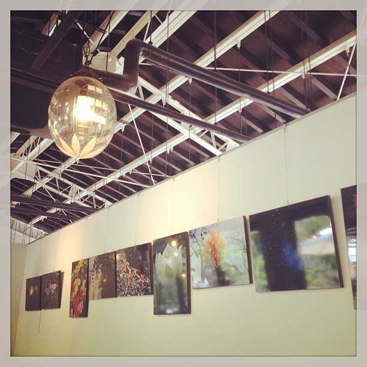
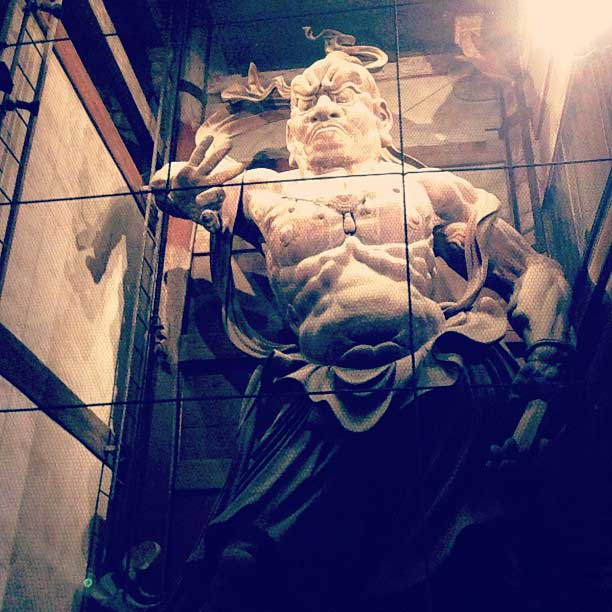

<small>燈花会の写真</small>

<!--more-->

夜はこの期間、燈花会があってよいムード。ビールと B 級グルメがいただけるので食いしん坊にもピッタリ。

<small>お昼は近くのカフェにいきました。</small>

朝からお寺を巡って疲れて行ったカフェ。雰囲気よくておいしかった、雑貨もよいカンジ。

<small>彼女は吽形像が好きになったみたい。</small>

仏像もたくさん見た。大仏さんは朝見に行ったらお経の時間に立ち会えたり、神秘的な時間を過ごせて良かった。

明日もいろいろ計画立てるので、楽しくなるとよいな。
