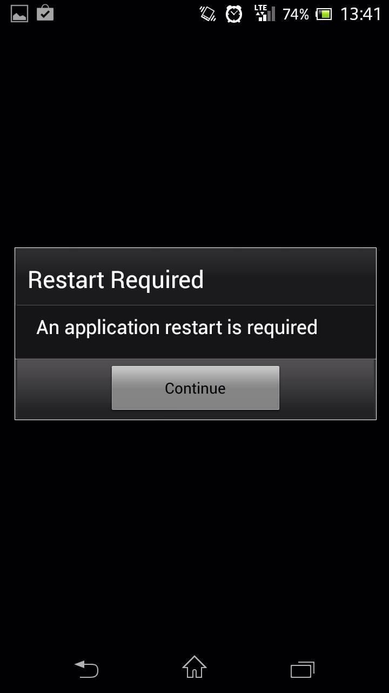

今日は Titanium で Google Play に公開したアプリケーションについて。

Google Play の「開く」かアプリケーションのショートカットから起動すると
"application restart is required" と表示されるエラーに悩まされた。

## 環境

起動時にこんなエラーが出る

<!--more-->



- Titanium SDK 3.1.3
- GALAXY S2 Android 4.0.2
- Xperia Z Android 4.1.3

## 修正方法

tiapp.xml に以下の 1 行を加える。

```xml
<property name="ti.android.bug2373.finishfalseroot" type="bool">true</property>
```

場所に注意が必要でこやつの下に加えないといけない。

```xml
<ti:app xmlns:ti="http://ti.appcelerator.org">
```

Android のみのエラーだからって<android>の下に加えると問題は修正されません。

```xml
<android xmlns:android="http://schemas.android.com/apk/res/android">
```

## こんなのもあったけど&#8230;

あと以下のプロパティを使っているものもあったけど少し情報が古いみたい。

finishfalseroot の 1 行のみでエラーは回避できてた。

```xml
<property name="ti.android.bug2373.disableDetection" type="bool">true</property>
<property name="ti.android.bug2373.restartDelay" type="int">500</property>
<property name="ti.android.bug2373.finishDelay" type="int">0</property>
<property name="ti.android.bug2373.skipAlert" type="bool">true</property>
<property name="ti.android.bug2373.message">Initializing</property>
<property name="ti.android.bug2373.title">Restart Required</property>
<property name="ti.android.bug2373.buttonText">Continue</property>
```

## bug2373 の原因

原因は Titanium っていうより Google のインテント周りのバグみたい。

> Titanium の ISSUE
> https://jira.appcelerator.org/browse/TIMOB-9285

> Google の ISSUE
> https://code.google.com/p/android/issues/detail?id=2373

Titanium SDK 2.0 のころからこのエラーはあったようで、

いろんな策が講じられて`ti.Android.bug2373`とかで検索すると

エラーの回避方法みたいな内容がブログなどにも書かれているけど

人によって書き方が微妙に違うのと、ちょっと古い情報もあったりして迷った。
