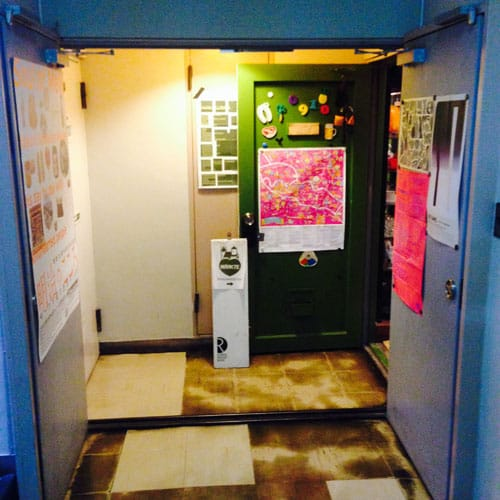
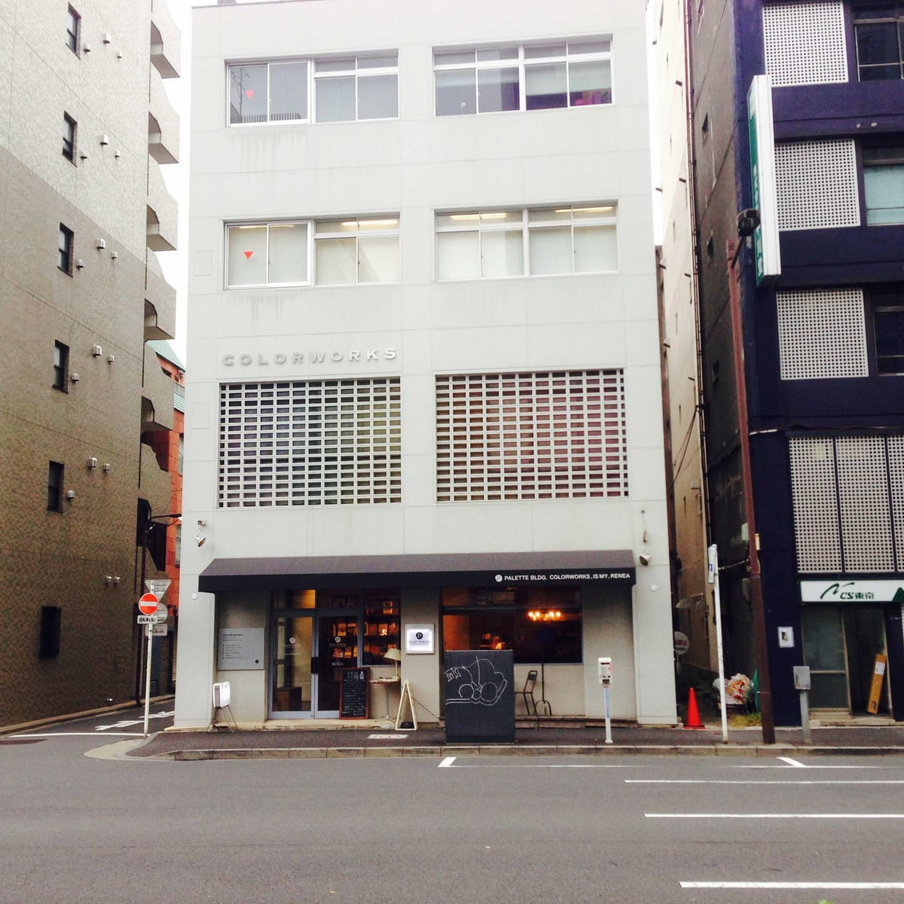

> 辛酸なめ子のギャラリー探訪記 「アガタ竹澤ビル」
> http://www.artgene.net/labo/theme/cat243/post_45.php

<!--more-->

> MARKTE
> http://www.riddledesign.cc/f_top.html

> cedok
> http://www.cedok.org/

アガタ竹澤ビルはギャラリーやカフェ、東欧雑貨屋が入ってた。

昔の雑居ビルをリノベーションしているので廊下の薄暗い雰囲気と、格好よさが好きだった。

> イズマイ
> http://ismy.jp/

> フクモリ
> http://fuku-mori.jp/

向かいの Palette bldg のイズマイでお昼にした。

ここは 1F がカフェで上階は壁材を扱っている会社でビル全体がショーケース的な役割を果たしていておもしろかった。
自分はミートパイを食べたけどおいしかった、今度は隣にあるフクモリも行ってみたい。

帰るときに思ったのが、Buro Destruct のビデオクリップに出てくる格好よい作業場の感じに似ていると思った。よい。

[MaRKR](http://vimeo.com/38870492) from [type-for-type.com](http://vimeo.com/user10223946) on [Vimeo](https://vimeo.com).

&nbsp;
