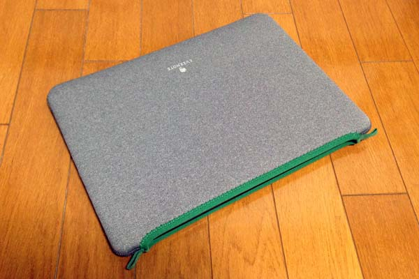

Evernote がネットでセレクトショップ始めたようですので、おしゃれだった MacBook ケースを買ってみました。

お値段は商品 ¥4410 + 送料 ¥600 でした。商品は注文してから 2, 3 日で届きました。

<!--more-->

## MacBook を実際に入れてみた感想

さっそく、丸一日持ち歩いて使ってみました。

## 良い点

このケースはジッパーがなく MacBook にピチっとしたパンツでも履かせているような感じのフィット感があります（笑）。
しっかりした作りで、写真でみるよりも厚みがあって手触りよく保護性もよくという感じ。

## 悪い点

弱点を挙げるとすれば取り出し口がピチっとしていて数秒では出し入れできません。
もしそういうユースがある並ばジッパー式のケースのほうが楽かな。

## まとめ

自分は今年最後の買ってよかったものでしたー。(実際はいただき物なんですが…ありがとうございます涙)

ポストイットとかザックもおしゃれなのそろえているので、見てみるとよいですよ。

> Evernote Market
> https://www.evernote.com/market
