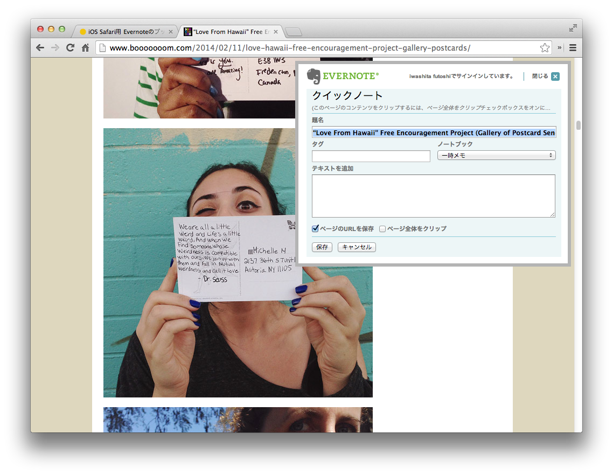

iPad や iPhone でも Web のクリップを手軽にしたいので、ブックマークレットを用意した、快適な Evernote Life を。



## 使い方

1.  Safari に適当なサイトのブックマークを追加
2.  そのブックマークの名前欄を「Evernote に追加」とかにする。
3.  さらに URL 欄は以下をコピー&ペーストして保存する。

```js
javascript:%28function%28%29 %7b%0d%0a%09EN_CLIP_HOST %3d %27http%3a%2f%2fwww%2eevernote%2ecom%27%3b%0d%0a%09try %7b%0d%0a%09%09var x %3d document%2ecreateElement%28%27SCRIPT%27%29%3b%0d%0a%09%09x%2etype %3d %27text%2fjavascript%27%3b%0d%0a%09%09x%2esrc %3d EN_CLIP_HOST %2b %27%2fpublic%2fbookmarkClipper%2ejs%3f%27 %2b %28new Date%28%29%2egetTime%28%29 %2f 100000%29%3b%0d%0a%09%09document%2egetElementsByTagName%28%27head%27%29%5b0%5d%2eappendChild%28x%29%3b%0d%0a%09%7d catch%28e%29 %7b%0d%0a%09%09location%2ehref %3d EN_CLIP_HOST %2b %27%2fclip%2eaction%3furl%3d%27 %2b encodeURIComponent%28location%2ehref%29 %2b %27%26title%3d%27 %2b encodeURIComponent%28document%2etitle%29%3b%0d%0a%09%7d%0d%0a%7d%29%28%29%3b
```

あとは Evernote に保存したいサイトで登録したブックマークレットを押すと…。

アプリケーションとかページ遷移せずに保存できる。
