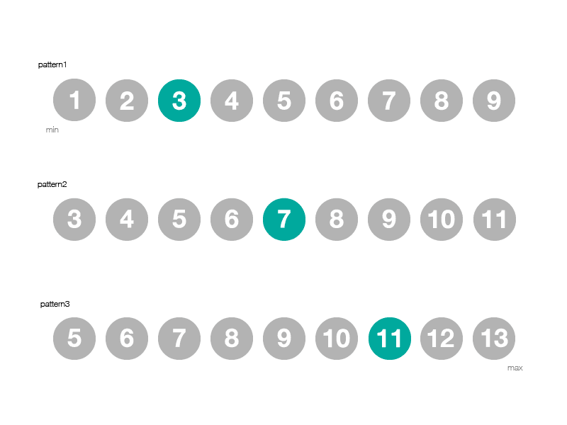

こんにちは、今日から三連休ということで、ワークスペースを利用してブログ書きます。

では WordPress で Bootstrap の Pagination を実装方法について、

メモしていきたいと思います。



> bootstarap の Pagenation
> http://getbootstrap.com/components/#pagination

<!--more-->

この HTML タグを WordPress の page に合わせて、

php で動的に生成すればよいわけです。以下が functions.php

Pagenation の動作って人によって微妙に違いがあるかと思うのですが、

自分は常に 9 個の Pagenation を出します。

Pagenation を出力したい任意の箇所で以下のコードを書けば OK です。

```php
<?php jaxx_pagination(); ?>
```
