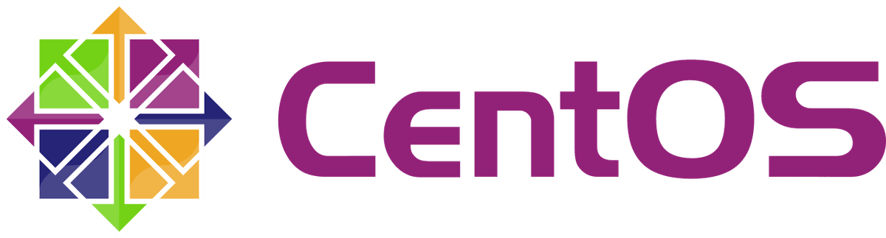

さくら VPS を CentOS7 へアップデートしました。

いろいろ変更点あったので備忘録としてメモしました。

## CentOS7 アップデート

OS のインストールとネットワーク周りはさくらの管理画面から。

「OS 再インストール」->「カスタム OS インストール」

<!--more-->

以下参照

> CentOS 7 カスタム OS インストールガイド
> http://support.sakura.ad.jp/manual/vps/cpanel/custom_centos7.html

## yum アップデート

```
$ yum -y update
```

## 日本語環境

```
$ emacs /etc/locale.conf
```

```conf
#LANG="en_US.UTF-8"
LANG="ja_JP.UTF-8"
```

## SELINUX 確認・無効

```
$ getenforce
$ setenforce 0
```

## ファイアウォール

初期設定だと ssh のみしか許可していないので http を追加。

```
$ firewall-cmd -state
$ firewall-cmd -list-services
$ firewall-cmd -add-service=http
```

## SSH

設定。SSH のポート番号は標準だと 22 ですが、

セキュリティ上任意の番号に変更します。

`$ emacs /etc/ssh/sshd_config`

```conf
Port ポート番号;
PermitRootLogin No;
```

ファイアウォールの設定も合わせて変更してください。

`$ emacs /usr/lib/firewalld/services/ssh.xml`

サービス開始

`$ systemctl restart sshd.service`

## LAMP 環境構築

php,MySQL,Apache,Emacs,wget を yum でインストール

> yum -y install emacs wget php-mysql php php-gd php-mbstring mariadb mariadb-server httpd

## Appache

使用状況によって違うので、必要最低限の設定。

> $ emacs /etc/httpd/conf/httpd.conf

```conf
# サーバーの名前を設定
# ServerName www.example.com:80
ServerName XX.XX.XX.XX:80

# ディレクトリごとに「.htaccess」を使用できるようにする。
# AllowOverride None
AllowOverride ALL

# デフォルトで文字コードを指定しないようにする
# AddDefaultCharset UTF-8
```

サービス開始

> $ systemctl start httpd.service

> $ systemctl enable httpd.service

## MySQL

MySQL は mariadb という名前になった様子。

> $ emacs /etc/my.cnf.d/server.cnf

```conf
[mysqld]
character-set-server = utf8
plugin-load = handlersocket.so
```

WordPress 用のユーザーと権限設定

```sql
create database データベース名;
grant all on データベース名.* to 'ユーザー名'@'ホスト名' identified by 'パスワード'
```

サービス開始と初期設定

> $ systemctl start mariadb

> $ systemctl enable mariadb

> $ mysql_secure_installation

```conf
既存password（デフォルトは空）
新規password
あとは全てyes
```

## WordPress

以下から最新バージョンを確認して 4.0 を入れます。

<a href="https://ja.wordpress.org/" title="https://ja.wordpress.org/" target="_blank">https://ja.WordPress.org/</a>

> $ cd /var/www/html/

> $ wget http://ja.wordpress.org/wordpress-4.0-ja.zip

> $ unzip wordpress-4.0-ja.zip

> $ mv -rf wordpress wp

あとは Web ルートの wp 配下からインストール作業。

以上駆け足で書いていきましたが、

CentOS7 でファイアウォールやサービスの開始・終了など変更点ありました。

conf ファイルなどの細かな設定は使用状況に合わせて検討してください。
