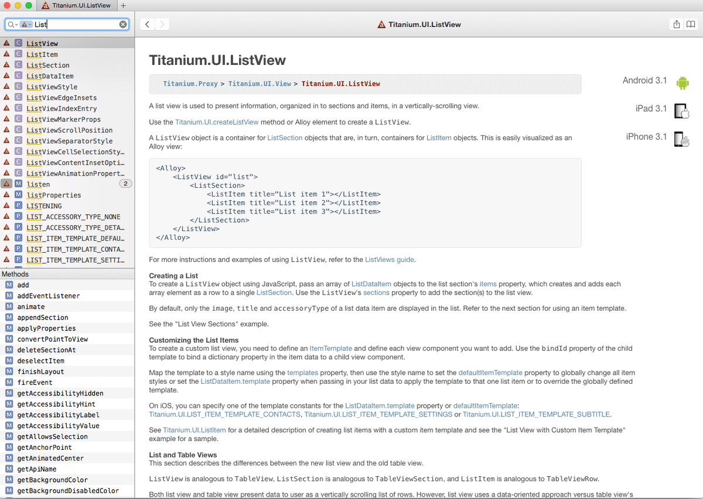

アプリケーションを作った際に、参考にしたサイトについて初心者目線ですが紹介したいと思います。

Titanium は以前に少しだけ触ったことがあって、その時は「Resources/app.js」に書く Classic なものでした。

個人的にアプリケーションを作りたい衝動にかられて開発環境も不十分なくせに、
iOS Developer Program に 7,800 円払ってしまったこと。
また数年さわっていない間に MVC フレームワーク「Alloy」が出ていておもしろそうだったので Titanium を使って初アプリケーションを作ることにしました。

## ドキュメント

公式ドキュメントを読んで開発環境と Alloy の基本構成は理解できました。

> Titanium 3.X - Appcelerator Docs
> http://docs.appcelerator.com/titanium/3.0/#!/guide

<!--more-->ｓ

ただ Titanium の各要素については調べる頻度が多いので、開発環境が Mac の場合は Dash に追加すると便利です。

> **Dash** > http://kapeli.com/dash

## サンプル

ドキュメント読んでいてもイマイチ理解できない時には、GitHub の Alloy リポジトリ内にいくつかサンプルがあります。

ListView を使うときには非常にお世話になりました。

> **appcelerator/alloy** > https://github.com/appcelerator/alloy/tree/master/test/apps/ui

## パフォーマンス

ある程度動くものが作れるようになった段階で、パフォーマンスを改善したいと思うようになりました。

対応方法はいくつかあると思うのですが、自分として効果が大きかったものをは以下 3 つです。

**1.リモート画像を使用する際はキャッシュする。**

同じ画像を複数回呼ぶ場合にはやったほうがよいなと思いました。

> **Image Best Practices** > http://docs.appcelerator.com/titanium/latest/#!/guide/Image_Best_Practices-section-30082525_ImageBestPractices-Cachingremoteimages

**2.メモリを管理する。**

「Alloy.Globals.navgroup = \$.navgroup;」とか便利ですが、

なんでもかんでもグローバルにしちゃダメだよって内容です。

> **Memory Management | TiDev** > http://www.tidev.io/2014/03/27/memory-management/

## アイコンやスプラッシュスクリーン

iOS、Android ともに画像周りは必要なものが多いのですが、以下のサイトでアイコンやスプラッシュスクリーンを一式そろえることができます。

> **TiCons** > http://ticons.fokkezb.nl/

以上です。

公式のドキュメントやらサンプルの紹介だけで申し訳ないんですが、
アプリケーションを Titanium で作ろうか考えている方の参考になればと思います。
ちなみに Titanium での開発は自分のような Web 開発の経験者でアプリケーション初心者みたいな人に向いていると思います。

> yomu
> https://itunes.apple.com/jp/app/yomu-rss-reader/id924321598?mt=8&#038;uo=4

アプリケーションも iOS 版だけストアに公開したのでよければ DL してください。

Titanium Advent Calendar 2014 14 日目は<a href="http://qiita.com/hntn" title="http://qiita.com/hntn" target="_blank">hntn</a>さんです。
