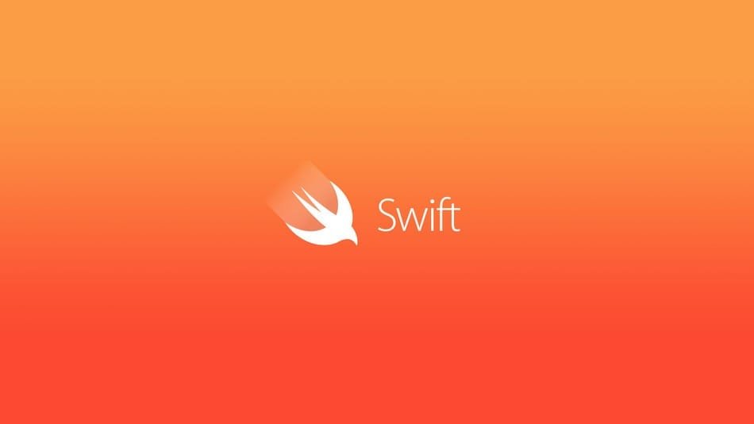
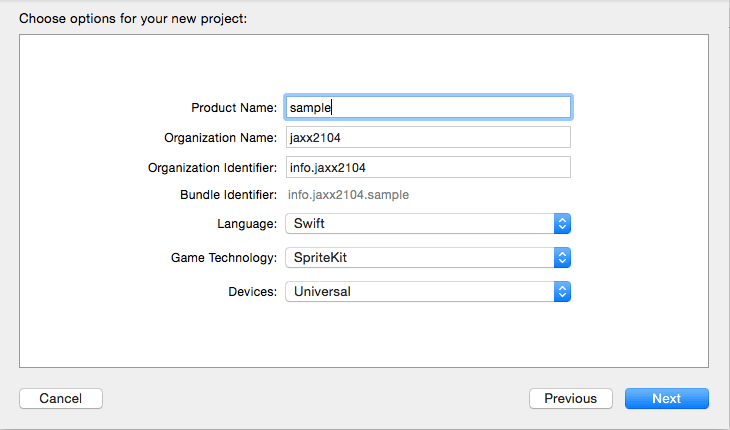
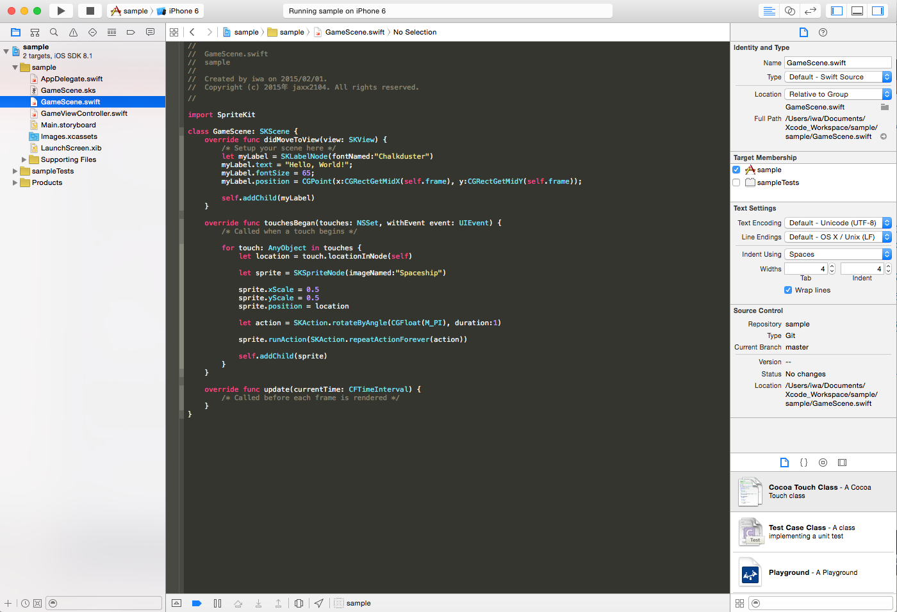
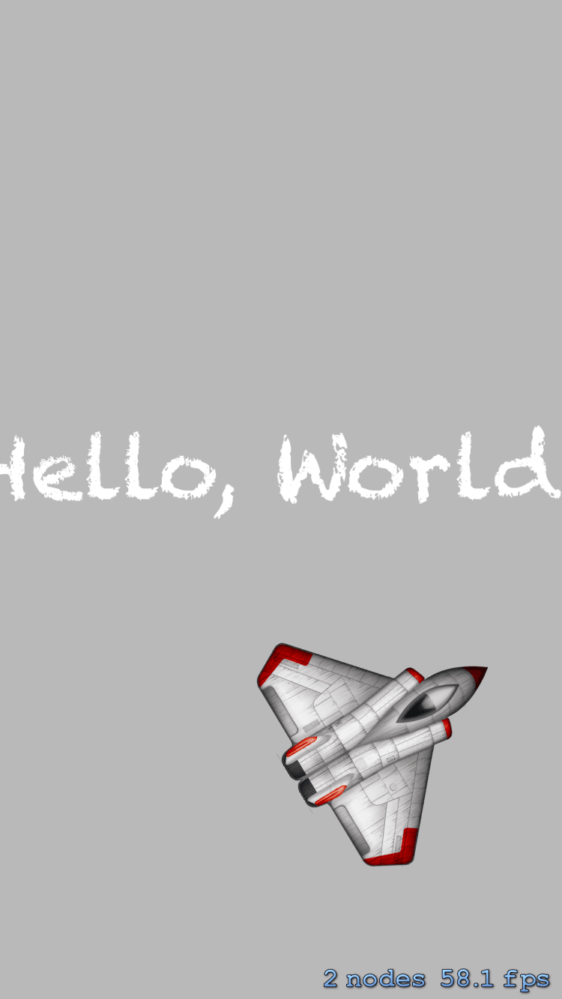

iOS の新プログラミング言語 Swift をゲームアプリケーションを作りながら触りたいと思います。

フレームワークは SpriteKit を使います。

## プロジェクトの作成

まず Xcode を App Store からインストールし立ち上げ、[File] -> [New] -> [Project] -> [Game] と選択します。Language は Swift で、GameTechnology は SpriteKit にします。

next を押すとプロジェクトの保存場所を聞かれます。

<!--more-->

プロジェクトができました。GameScene.Swift がアプリケーションの初期画面です。コードを少しだけ見てみましょう。

<small>GameScene.Swift</small>

まず、**import SpriteKit** で SpriteKit を利用しています。

クラスの GameScene の**SKScene** は 1 画面の役割です。

`didMoveToView`は画面が呼ばれた際に実行されるメソッド、初期状態では SKLabelNode で&#8221;Hello World&#8221;とセットしています。`touchesBegan`は画面がタップされた時に実行されるメソッド、タッチした座標に SKSpriteNode で画像を表示・回転しています。`update`は画面が毎フレームごと実行されるメソッドです。

## シミュレータ実行

iOS シミュレーターでアプリケーション動かしてみましょう。

デバイスを「iPhone6」選択し、再生アイコンを押します。

iOS シミュレーターが起動し、アプリケーションが実行されれば OK です。

次回から実際に作って行きたいと思います。
