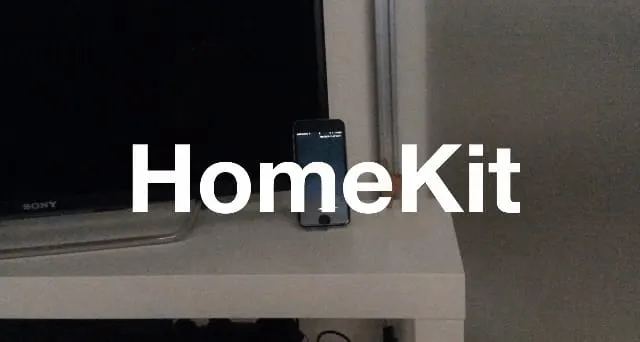
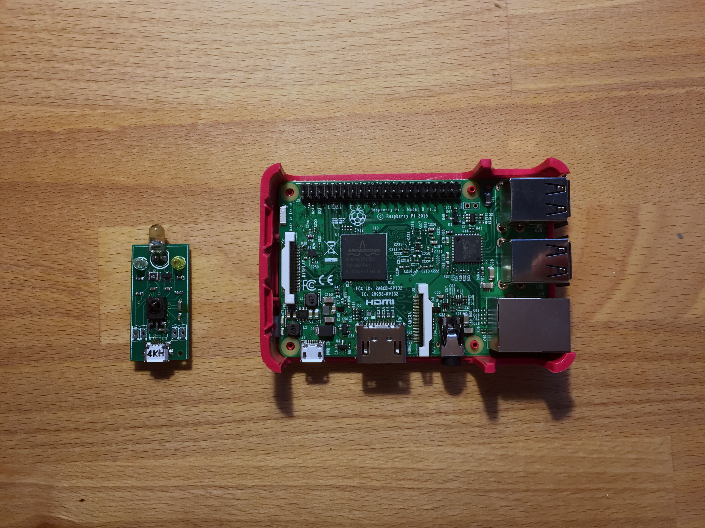
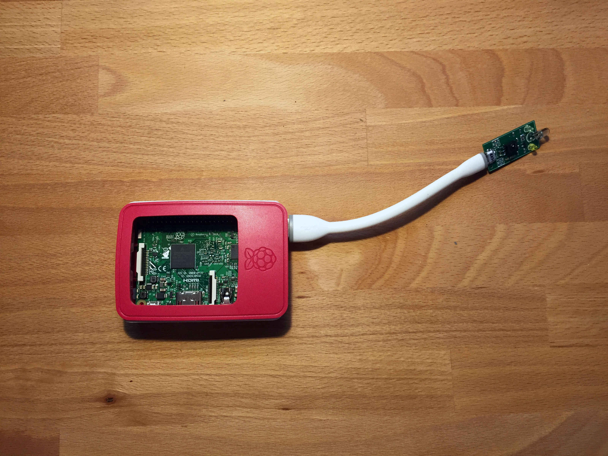
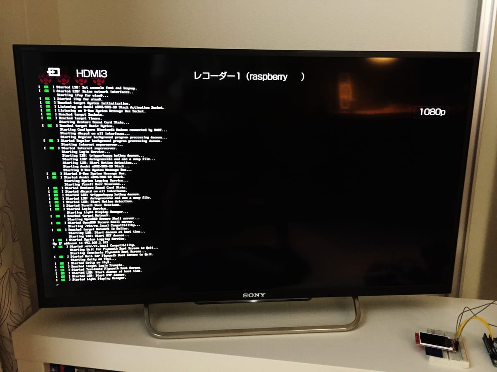
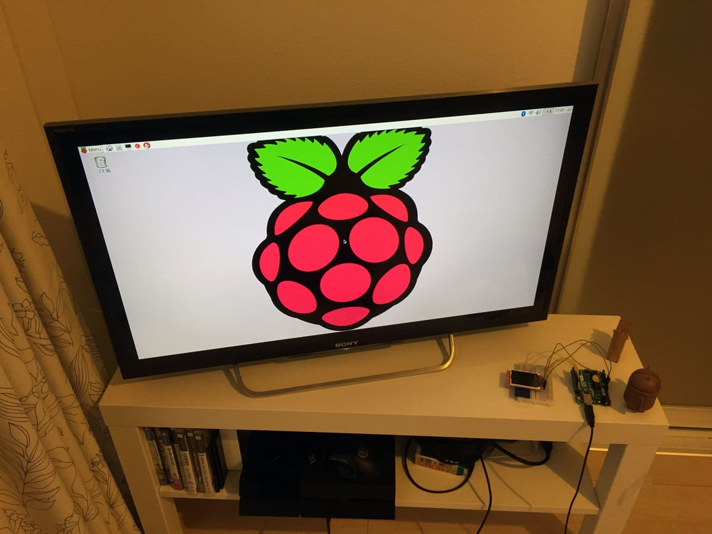
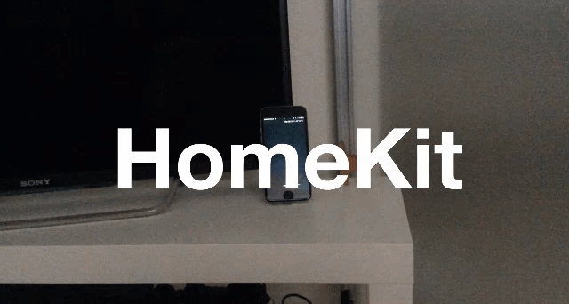

暑い季節になってきました。夏の自由研究ということで電子工作と IoT に挑戦したいと思います。

エアコンをリモートコントロールできたら快適だなぁと思ったので、家をスマートホーム化してみました。

## HomeKit と Homebridge

まずどうやってスマートホーム化するか。

iOS の Homekit というものを使えば iPhone から Homekit 対応した家電を操作できます。

今後 iOS 10 で Home アプリケーションも出て対応製品も出てくるはず、でも現在日本ではこれを扱った製品はあまり多くありません。

で既存製品でも対応できるよう Homebridge という Node.js のライブラリが公開されています。

> nfarina/homebridge
> https://github.com/nfarina/homebridge

今回はこの Homebridge を使って開発しようと思います。

<!--more-->

## Raspberry Pi と irMagcian



<small>左が irMagcian、右が Raspberry Pi ３のモデル B</small>

いつでも家電を操作できるよう homebridge を常に起動しておきたいので、サーバを用意する必要があります。なので以前から気になっていた Raspberry Pi を買いました。4000 円で安くてびっくり。

> Raspberry Pi
> https://www.raspberrypi.org/

合わせてエアコンや照明を操作するため赤外線モジュールの irMagcian を買いました。これも 4000 円。

> irMagcian
> http://www.omiya-giken.com/?page_id=837



<small>ケースに入れて USB で接続</small>

## Raspberry Pi の設定をする

Raspberry Pi はスマートホーム用サーバにする予定ですので、家の中心に設置しました。

あとは以下の手順で設定しました。

- Raspberry Pi の公式サイトで「NOOBS」をダウンロード
- マイクロ SD にフォーマットして「NOOBS」を書き込む
- Raspberry Pi にマイクロ SD とマウス、キーボード、HDMI を接続する
- microUSB ケーブルをつなぎ電源を入れる



<small>起動時</small>

OS「RASPBIAN」インストール後、言語や LAN など設定します。

その後コンソールから`sudo apt-get update`と`sudo apt-get upgrade`してアップデート

`apt-get install fonts-ipaexfont`で日本語フォントのインストール

ローカル IP 固定とポート開放して認証鍵で Mac から ssh で接続できるようにします



<small>デスクトップ画面</small>

## irMagcian の設定をする

以下の URL で紹介されている irm.py を利用しました。

> 小型赤外線（IR）リモコン irMagician ファースト・インプレッション
> <http://netbuffalo.doorblog.jp/archives/4872290.html>

```
# sudo apt-get install python-pip
# sudo pip install pyserial
```

以下のコマンドでエアコン、ライト、テレビなどのリモコンを学習させます。

これでコマンドさえたたけば家電を操作できるようになりました。

```
// エアコンの赤外線をirMagcianにキャプチャします。
$ python irm.py -c

// キャプチャしたデータをファイルとして保存します。
$ python irm.py -s -f ./data/fan/on.json

// 保存したデータを実行します。エアコンがつきます。
$ python irm.py -p -f ./data/fan/on.json
```

## Homebridge の設定をする

以下の URL にならって Homebridge をインストールし、デーモン化します。

> Running HomeBridge on a Raspberry Pi
> <https://github.com/nfarina/homebridge/wiki/Running-HomeBridge-on-a-Raspberry-Pi>

Homebridge を使ってコマンドをたたけるようにプラグインをインストール。

```
$ sudo npm install -g homebridge-cmd
```

`.homebridge/config.json` の設定ファイルを編集します。

```json
{
  "bridge": {
    "name": "Homebridge",
    "username": "CC:22:3D:E3:CE:30",
    "port": 51826,
    "pin": "031-45-154"
  },
  "description": "test",
  "accessories": [
    {
      "accessory": "CMD",
      "name": "テレビ",
      "on_cmd": "sudo python irm.py -p -f ~/.homebridge/data/tv/on.json",
      "off_cmd": "sudo python irm.py -p -f ~/.homebridge/data/tv/off.json"
    },
    {
      "accessory": "CMD",
      "name": "ライト",
      "on_cmd": "sudo python irm.py -p -f ~/.homebridge/data/light/on.json",
      "off_cmd": "sudo python irm.py -p -f ~/.homebridge/data/light/off.json"
    },
    {
      "accessory": "CMD",
      "name": "寝室のエアコン",
      "on_cmd": "sudo python irm.py -p -f ~/.homebridge/data/fan/on.json",
      "off_cmd": "sudo python irm.py -p -f ~/.homebridge/data/fan/off.json"
    },
    {
      "accessory": "CMD",
      "name": "リビングのエアコン",
      "on_cmd": "sudo python irm.py -p -f ~/.homebridge/data/fan2/on.json",
      "off_cmd": "sudo python irm.py -p -f ~/.homebridge/data/fan2/off.json"
    }
  ]
}
```

`sudo service homebridge restart` で設定ファイルを反映します。

## iPhone から使ってみる



HomeKit 対応アプリケーションから設定します。Insteon とういうアプリケーションが有名みたいですが、自分は iOS 10 ベータにアップデートして Home アプリケーションを使っています。
Siri もしくは Home アプリケーションから登録した家電のコントロールができるようになりました。

また AppleTV か iPad を持っている人は外からのコントロールやオートメーション機能が使えます。
オートメーション機能では、時間や場所を起点として家電のオンオフを自動化できます。以下のようなことができます。

- 家から離れた時にエアコンとライトをオフ
- 家から近付いた時にライトをオン
- AM2:00 にエアコンをオフ

以上でスマートホームの完成です。
今後やりたいことはこいつを BOT 化して Slack からコントロールできるようにしたり、Arduino も買ったので連携させたりしたいです。
