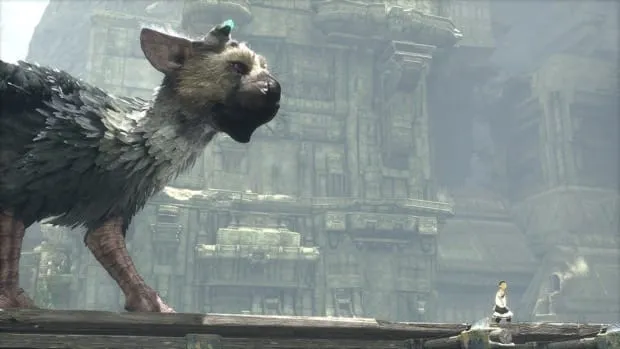

かなり遅いけれど最後の正月休みなので区切りのため去年を振り返ってみました。

## IoT 関連

今までこれといった趣味がながったのですが、HomeKit や Raspberry Pi を中心としたスマートホーム化をきっかけにハマった 1 年でした。
現在は自宅の照明やエアコン、温度計を自動化し快適な生活を過ごしています。
アドベントカレンダーでは irMagician の homebridge プラグインを作成しエントリにしました。

正月前に chibi:bit をポチったのと、Kickstarter で Neture Remo に出資したので暑い夏までに届くとよいなと思ってます。

## 人喰いの大鷲トリコ

2016 年で一番良かったゲーム。トリコに感情移入しすぎてエンディングに向かっていくのが切なくも感じた。

<!--more-->

## スマートウォッチ購入

腕時計で家電を操作したいという思いがあり Apple Watch2 を購入しました。買って半年経ったいまも毎日欠かさず身につけています。
用途はマップや、天気や通知を受けたり ApplePay、Swarm などを使ったりしています。
バッテリーの持ちは一日普通に使って 20％ くらいで 3 日連続くらいは充電せず使えます。

でもユーティリティも、ゲームも携帯の補助機能の域を出ていないので今買うものでもなもったかなぁと思っています。ルンバ買ったほうが良かったなと思ってます。

## JS フレームワークやビルドツール

React.js、Vue.js といった JS フレームワーク
npm、Babel、gulp、browserify、Webpack など周辺の開発ツールを学習しました。

## GitHub や Qiita

個人的にやった事はブログ以外に GitHub や Qiita などにもアウトプットをするように心がけました。
結果として仕事のプロジェクトでも活用できたし、個人で Gatsby という React.js 製の静的サイトジェネレータのテーマ開発をしたりして、GitHub で初スターをもらったこと Qiita でもよいねが割ともらえたことはうれしかったです。

今年もよいコードを書きたいと思います。
