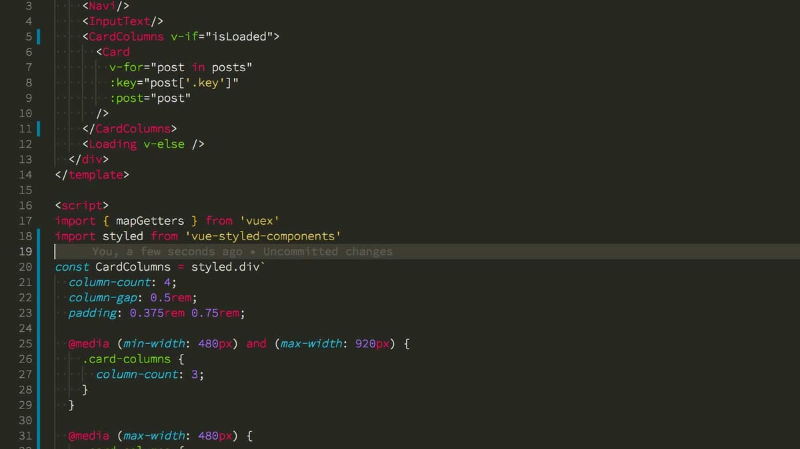
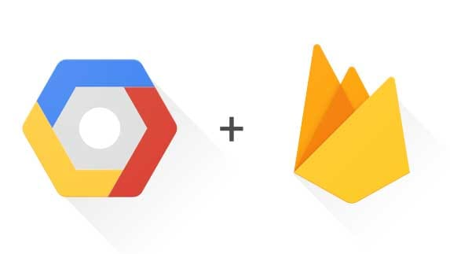

夏休みの期間でやったこと、技術的な部分は Qiita にエントリーでも書きたいけど仕事復帰すると忘れてしまいそうなのでこのエントリーは一旦のメモです。（写真は 6 日目に行った蔵前のカフェ）

- 1 日目: vue で styled-components をやってみる `@千葉`
- 2 日目: GCP の App Engine を触る
- 3 日目: GCP の App Engine で API サーバー と cron をデプロイ `@銚子`
- 4 日目: Go を触る `@銚子`
- 5 日目: GCP の App Engine で Go をデプロイ
- 6 日目: Firebase Cloud Functions を触る `@蔵前`
- 7 日目: Firebase で SSR をやってみる
- 8 日目: キーボードを購入する `@渋谷`
- 9 日目: ひたすら寝る

文字におこすとやった感ある。
だけど一日の大半は遊んでいて実際は大したことやってないです。

<!--more-->

## vue-styled-components を試してみる

Nuxt.js（Vue.js）で作った [Nikuman](https://nikuman.jaxx2104.info/) を scss から styled-components へ置き換えてみた。

**微妙な部分**

- 単一テンプレートがあるので「JSX と一緒に書ける」という React のメリットはない

**よかった部分**

- React の Stateless Functional Components の代わりとしてレイアウト要素がシンプルに書ける
- React の Context API の代わりに Theme の設定ができる
- （微妙だった部分の単一テンプレートに関して）一方で変更が記法のみなので移行しやすい

あと VSCode で色付けが効いてなかった。なので VSCode の拡張機能を修正して PR を出した。

> Add support vue
> https://github.com/styled-components/vscode-styled-components/pull/123

vue-styled-components を使う人が増えてマージされて欲しい 🙏

## Firebase と GCP を触る

フロントエンドエンジニアとしてインフラまわりの技術は浅くてもいいので広く知っておきたかったので、 AWS 以外のオーケストレーションツールとして GCP の App Engine のチュートリアルとドキュメントを見ながら API サーバーと cron を動かしてみた。

Firebase は、これまで Realtime Database と Auth しか使ってなかったので、
今回 Firebase Hosting と Cloud Functions を使って Nuxt.js で SSR をやってみた。

**微妙な部分(まだ詳しくない)**

- AWS より設定の詳細度は劣るので既存プロジェクトの導入は難しい場合がありそう

**よかった部分**

- 設定が単純（カスタムドメインや CDN の利用がしやすかった）
- Firebase 連携の使い勝手がいい
- チュートリアルがわかりやすくて感動（Cloud Shell や開発環境がいい）

[Nikuman](https://nikuman.jaxx2104.info/) を Netlify から Firebase と GCP に移行した。

- Nuxt.js で prerender (nuxt generate) していたが SSR（nuxt build）するように
- Firebase Hosting にクライアントのデプロイ設定
- Cloud Functions にサーバーのデプロイ設定
- Circle CI で master merge 時に firebase deploy するように
- Cloud Functions に CDN キャッシュの設定

Cloud Functions だとコールドスタートとなってしまうため、久しくアクセスした際に表示時間がかかってしまいます。これに関しては CDN キャッシュを使って回避。

## Go を触る

あとで追記する

## その他のメモ

- 使わなくなってしまった iMac, iPad, Beats Solo2 を売る 💰
- 奥さんに AppleWatch をプレゼントする ⌚ 自分はキーボードを ️ 購入 ⌨️
- 美味しいご飯と一緒に美味しいコロンビアコーヒーとヴァイツェンビール飲んだ 🍺
- 娘の仕草がかわいい、猫に興味を持ちはじめる 🐱

以上です。明日（今日）から会社！
技術的な部分は Qiita にエントリーは忘れずやりたい。
