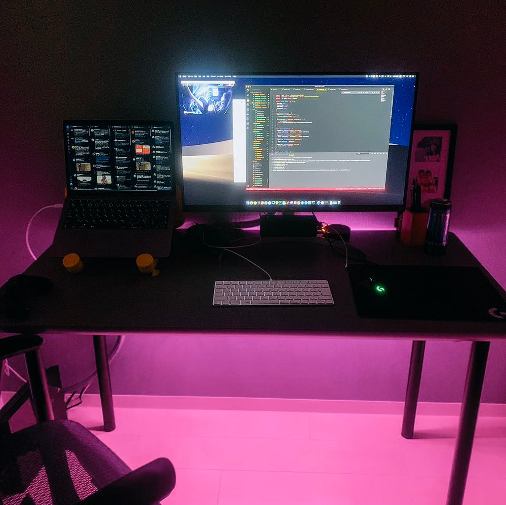

スマートホームはラズパイで自作しなくても安く構築できる時代

## 3 大 AI アシスタントを全部試してみて

Siri、Google Home、Alexa を実際使ってみた。
スマートホーム 1.0 の頃は Homebridge とラズパイの組み合わせで Siri が大活躍だった。
その後 Google Home と Alexa を導入し、スマート家電の種類も増え、ラズパイは別の用途で使うようになった。

個人的には Google Home の mini じゃないやつが優勝だと思う。
理由を書く。

**海外製品の日本語対応**

どちらかというと Alexa が残念で日本語対応されていない場合、
Amazon.com のアカウントで Alexa をアクティベートしないといけない。
Amazon Music など Amazon.co.jp アカウントなので利用できないし不便。

Google Home の場合は日本語対応されてない事がそもそもなかった。

**アプリの使い勝手**

Google Home アプリは機能面でも UI でも快適。
唯一欠点を挙げるとスケジュールのハブ機能が物足りない。
だがスマート家電ごとのアプリで設定はできるので不便はしていない。

**できること**

**購入したスマート家電**

- Nature Remo (学習リモコン、日本製のレガシー家電には必須）
- Rumba (掃除ロボ、9 万円のモデルのみ対応)
- Xiaomi のスマート家電

これで「おはよう」と言えば天気を読み上げる & ダイニング照明 100% & テレビをつけるし「おやすみ」と言えばテレビ消す & リビング照明 10% & 寝室照明みたいなことをしてくれる。

## Xiaomi 家電のコスパが良すぎる

購入して思うのが AI アシスタントと連携できるスマート家電は少ないし、高すぎる。
そんな中で Xiaomi の家電は安いし使い勝手もいいのでオススメしたい。

<blockquote class="twitter-tweet" data-partner="tweetdeck">
書斎とベットをXiaomiの電飾でオシャンティにした。スマート家電なので完璧。 <a href="https://t.co/Z8SUyFmw4L">pic.twitter.com/Z8SUyFmw4L</a>
&mdash; ᴊᴀxx₂₁₀₄ (@jaxx2104) <a href="https://twitter.com/jaxx2104/status/1048591056600629248?ref_src=twsrc%5Etfw">October 6, 2018</a></blockquote>

これを Amazon.com のインターナショナルシッピングから購入した。

- YEELIGHT Smart Wifi LED Light Strip × 2
- YEELIGHT Smart LED Bulb × 3

寝室照明を焚き火のような黄色から橙色のゆらぎ照明にしていて、眠りやすい。

あと Rumba を買ったが Xiaomi からも同様の製品が出ていて安い。
掃除っぷりも動画で見た感じ良いので、とても気になる。
