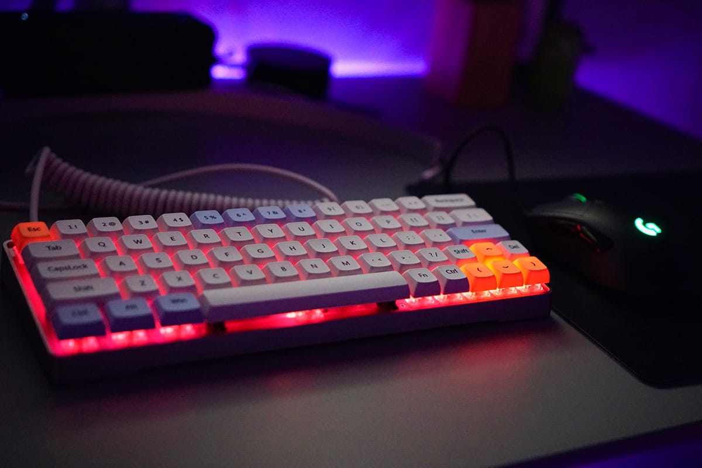

自作キーボード沼に最短でハマるまでの手順書を書き記しておきます。

ここ 1,2 ヶ月で興味を持ち始めて自作キーボードデビューしました！

沼にハマってからは、会社にキーボードの Slack チャンネルを作り、テックブログにも記事を書きました。
この短期間でかなり下調べしたつもりですが、誤りがあった場合は優しく指摘してもらえればと思います 🙏

この手順書は自作キーボードに興味があるけど、自分と同じようにパーツや用語いろいろあってわからないという人向けに書いたものです。

## 概要

まずは以下の手順でパーツを選ぶとスムーズです。

- キーボードの基盤（PCB）を選ぼう
- キーボードのプレートとケースを選ぼう
- キースイッチを選ぼう
- キーキャップを選ぼう

<!--more-->

## キーボードの基盤（PCB）を選ぼう

まずはキーボードのベースとなる基盤から決めましょう。
選定基準はキー数と配列、はんだ付けの有無から決めると良いと思います。

**キー数と配列**

- 100%: フルサイズキーボード
- 87%, 80%: テンキーレスキーボード
- 60%: コンパクトキーボード
- 40%: ミニマムキーボード
- 20%: テンキー

他にも格子配列や分離型などの変わった形をしたキーボードもカッコいいのでチェックすると良いと思います。
以下の記事で実際の写真付きで解説してくれているので見るとわかりやすいです。

> Full-size, TKL, 60% and more: a guide to mechanical keyboard sizes
> https://www.keyboardco.com/blog/index.php/2017/08/full-size-tkl-60-and-more-a-guide-to-mechanical-keyboard-sizes/

自分はパーツが多く出回っている 60% キーボードを購入しました。

**はんだ付けの有無**

自分も初心者ではんだ付けが苦手なんですが **Hotswap** と記載あるものだと、
キースイッチを PCB にはんだ付けせず使う事ができるのでおすすめです。

自分は以下のショップから GK64 RGB 60% 64keys hot swap PCB を購入しました。
60% だけど移動キー付の配列、ビルトイン RGB ライト&マイク、Type-C でいい感じです。

> GK64 RGB 60% 64keys hot swap PCB
> https://kbdfans.cn/collections/pcb/products/gk64-rgb-60-64keys-hot-swap-pcb

## キーボードのプレートとケースを選ぼう

次に PCB を覆うケースとプレートを決めます。PCB と互換性があるものを選ぶ必要があります。
なので色と素材程度しか選択肢がないと思うので好みで決めましょう。  
（互換性は Raddit などでも話させれているので調べてみましょう）

## キースイッチを選ぼう

代表的なキーキャップは赤軸、青軸、茶軸、黒軸ですが、
それ以外にメーカーごとでも多くの種類があるので以下の動画で決めるのがおすすめです。

<iframe width="560" height="315" src="https://www.youtube.com/embed/_N7adWvQDM4" frameborder="0" allow="accelerometer; autoplay; encrypted-media; gyroscope; picture-in-picture" allowfullscreen></iframe>

Cherry MX と互換性のあるキーキャップで代表的なものは Cherry MX、Kailh、Gateron などがあります。
最近はキーストロークの浅いロープロファイルなキースイッチもあるので、気になる人はそちらもチェックすると良いと思います。

> Kailh ロープロファイルスイッチ、遂に触ったぞ！
> http://romly.com/archives/2018/02/kailh_lowprofile_switch.html

自分は Gateron の Red Silent と Cherry MX の Blue を買いました。
次はロープロファイルスイッチも買ってみたいですね。

## キーキャップを選ぼう

**素材**

キーキャップの素材についてはほとんどが樹脂製で、ABS、PBT のどちらかであることが多いです。
個人的に素材よりは、後述のプロファイルで決めるがいいと思います。

**プロファイル**

- CHERRY: 背は低め段差あり。ドイツの GMK 社製で値段は高いが高級感がある。
- SA: 背は高く段差あり。アメリカの Signature Plastics 社製だが中国でクローンが出回っている。レトロ感がある。
- DSA: 背は低く段差なし。アメリカの Signature Plastics 社製だが中国でクローンが出回っていて安い。
- XDA: 背は低く段差なし。中国製の新しめのプロファイル。DSA を丸っこくしたかわいい形状。
- MDA(MIX): 背は低く段差あり。中国製の新しめのプロファイル。XDA に段差を設けた形状。

他にも無刻印、印字方法、バックライト透過などがあるので探してみてください。
実際に組み立てるまで似合うものか分からないので、最初はクローン製品で安いものを試すのがおすすめです。

個人的には XDA、MDA の形状が丸っこく自作キーボードらしさを感じて好みです。

## 組み立てよう

YouTube にある動画を見ながら組み立てるとわかりやすい思います。
自分はららぽんさんの動画を見て組みました。

<iframe width="560" height="315" src="https://www.youtube.com/embed/nk5DdSI1zNg" frameborder="0" allow="accelerometer; autoplay; encrypted-media; gyroscope; picture-in-picture" allowfullscreen></iframe>

## おわりに

以上です。興味がある人は実際に自作キーボードを作ってみてはどうでしょうか。
最後に自分のキーボードの写真を貼って終わりたいと思います 🙋

