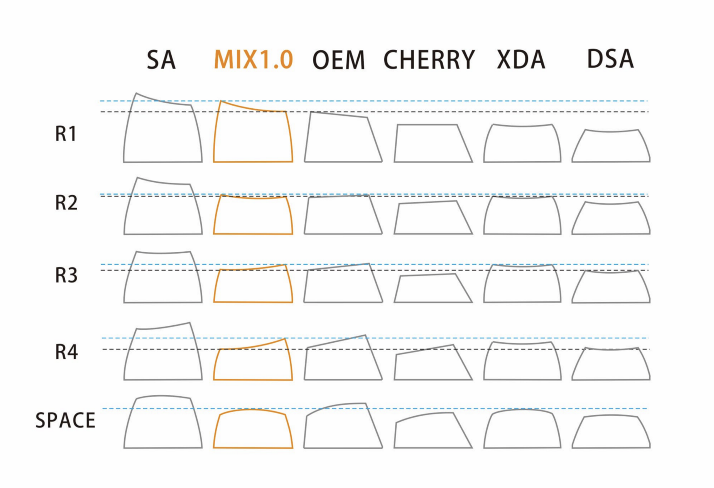
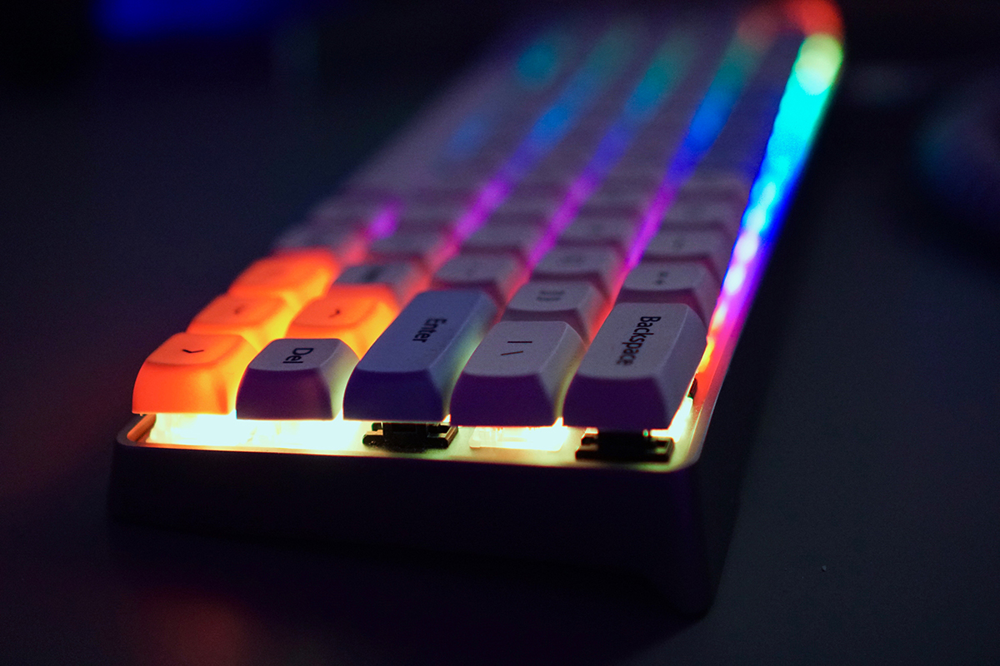
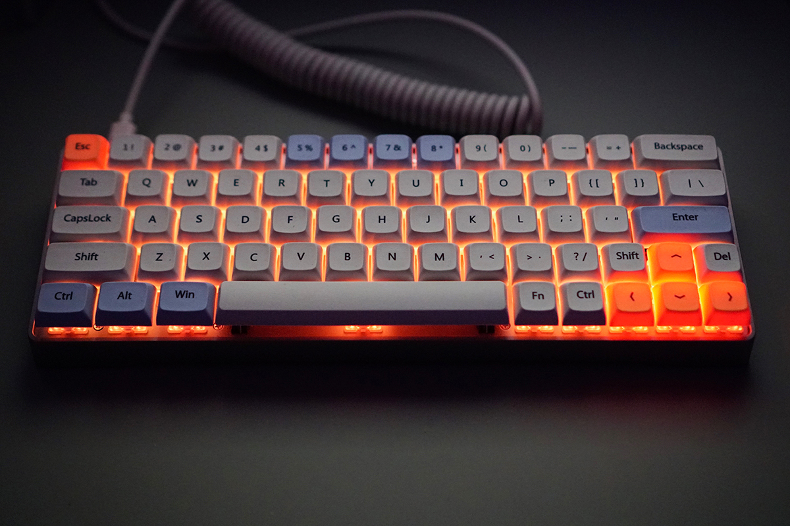

## 対象となる人

- 自作キーボードに興味があり始めてみたい人
- パーツがいろいろあってわからない人
- 電子工作が苦手な人

## 概要

- キーボードの基盤（PCB）を選ぼう
- キーボードのプレートとケースを選ぼう
- キースイッチを選ぼう
- キーキャップを選ぼう

## キーボードの基盤（PCB）を選ぼう

まずはキーボードのベースとなる基盤から決めましょう。
選定基準はキー数と配列、はんだ付けの有無の観点から決めると良いと思います。

### キー数と配列

- 100%: フルサイズキーボード
- 87%, 80%: テンキーレスキーボード
- 60%: コンパクトキーボード
- 40%: ミニマムキーボード
- 20%: テンキー

以下の記事で実際の写真とあわせて解説してくれているので見るとわかりやすいです。
https://www.keyboardco.com/blog/index.php/2017/08/full-size-tkl-60-and-more-a-guide-to-mechanical-keyboard-sizes/

他にも格子配列や分離型などの変わった形をしたキーボードもカッコいいのでチェックすると良いと思います。

個人的には 60% キーボードのパーツが多く出回っているので、
強いこだわりがない場合は、こちらを購入するのが良いと思います。

### はんだ付けの有無

自分も初心者ではんだ付けが苦手なんですが **Hotswap** と記載あるものだと、
キースイッチを PCB にはんだ付けせず使う事ができるのでおすすめです。

自分は以下のショップから GK64 RGB 60% 64keys hot swap PCB を購入しました。
60% だけど移動キー付の配列、ビルトイン RGB ライト&マイク、Type-C でいい感じです。

> GK64 RGB 60% 64keys hot swap PCB
> https://kbdfans.cn/collections/pcb/products/gk64-rgb-60-64keys-hot-swap-pcb

## キーボードのプレートとケースを選ぼう

次に PCB を覆うケースとプレートを決めます。PCB と互換性があるものを選ぶ必要があります。
なので色と素材程度しか選択肢がないと思うので好みで決めましょう（互換性は Raddit などで言及されていたりします）

ケース

> Mechanical keyboard anode aluminum case 60%
> https://kbdfans.cn/collections/60-layout-case/products/mechanical-keyboard-shell-anode-aluminum-shell-gh60-poker-60-mechanical-keyboard-shell?variant=36017578253

プレート

> DZ60 CNC (ALUMINUM/STEEL/BRASS) PLATE
> https://kbdfans.cn/collections/keyboard-part/products/dz60-cnc-aluminum-plate

## キースイッチを選ぼう

代表的なキーキャップは赤軸、青軸、茶軸、黒軸ですが、
それ以外にメーカーごとでも多くの種類があるので以下の動画で決めるのがおすすめです。

<iframe width="560" height="315" src="https://www.youtube.com/embed/_N7adWvQDM4" frameborder="0" allow="accelerometer; autoplay; encrypted-media; gyroscope; picture-in-picture" allowfullscreen></iframe>

Cherry MX と互換性のあるキーキャップで代表的なものは以下 3 つです。

- Cherry MX
- kailh
- Gateron

自分は Gateron の Red Silent を買いました。

## キーキャップを選ぼう

https://www.massdrop.com/talk/887/xda-keycaps-a-new-keycap-profile

https://kbdfans.cn/collections/keyboard-part/products/pcb-stabilizers-black-color

## キー配列を変えよう

http://www.keyboard-layout-editor.com

## おわりに

組み立て

