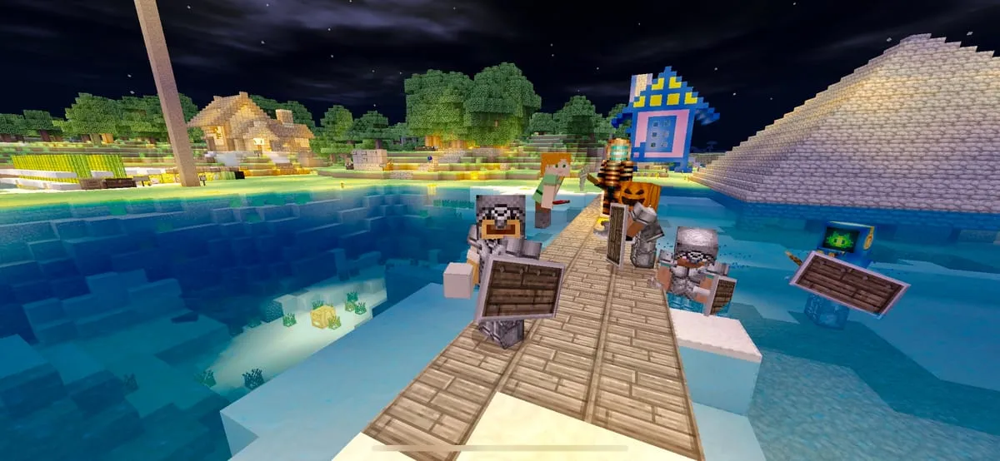

フロントエンドチーム（10 ~ 20人程度）で遊びたかったのでメモ

[*** サーバー情報]

[*** 技術選定]

[** ホスティングサービス]

<https://cubedhost.com/mcpe-hosting>
- スペックが細かく調整できるが規模的に価格が高い
https://www.bisecthosting.com/mcpe.php
- 安いが Edition の選択肢が少ない、管理画面がダサい
https://ramshard.com/minecraft-pocket
- 細かい設定ができて価格お手頃、結局これにした
https://scalacube.com/hosting/server/minecraft-pe
- そこそこ設定が出来た
https://www.minecraft-hosting.pro/
- ゲーミングサーバーと言う感じのサイトで分かりづらかった
https://netherbox.com/
- Edition の選択肢が少ない、管理画面はいい感じだが在庫切れで購入が出来なかった

[** Edition]

Bedrock Edition: 公式のクロスプラットフォーム版
- Minecraft Realms https://www.minecraft.net/ja-jp/realms/
- Official Bedrock Server https://www.minecraft.net/ja-jp/download/server/bedrock/
- Plugin Server 
- NukkitX https://nukkitx.com/
- PocketMine-MP https://www.pocketmine.net/?lang=ja

凝ったことやらないので Official Bedrock Server にした
（マップビューワーとか出来なくて今になって後悔している）

[** Mod]

一旦、自分の設定
テキスチャ: https://www.johnsmithlegacy.co.uk/
シェーダー: https://mcpedl.com/sspe-shader/

[*** 運用]

[** 前提]

バグかもって思ったら普段と同じように以下の手順で確認しましょう
再現させる
デバッグする
対応する

[** アップデートの方法]

バージョン指定を変更する
install.sh の内容を変更する
サーバーを再起動する

[** 環境構築の方法]

1. Docker 入れる https://www.docker.com/
2. Kitematic 入れる https://kitematic.com/
3. コンテナ検索する（自分はこれ） https://hub.docker.com/r/lomot/minecraft-bedrock
4. 実行

