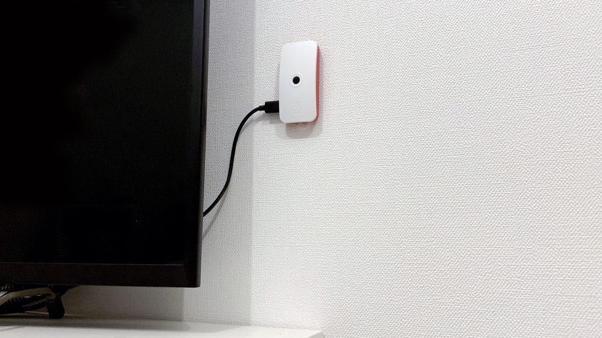
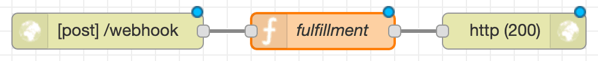
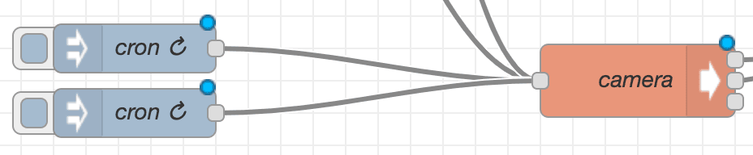

以下の機能がある定点カメラを作成しました。

- 音声コマンドで撮影が出来る
- スケジュール機能がある
- クラウドストレージに保存が出来る

**経緯**

[2016](/homekit-irmagician) 年までは Raspberry Pi と homebridge を使って自作でスマートホームを構成していましたが。
[2018](/smarthome-xiaomi) 年以降は既成品も充実してきたので、これまでの Raspberry Pi の用途は無くなってしまいました。

**やること**

最近は WEB サイトや CLI ツールを作ることが多かったので Raspberry Pi を使ってモノづくりが出来ないかなと考えて、だいぶ前に観た「父親が娘の写真を 18 年間撮ってつなぎ合わせた動画」が勝手な親心ながら良いなと思ったので、Raspberry Pi を使って似たようなことを自動化をしてみることにしました。

<!--more-->

<iframe width="560" height="315" src="https://www.youtube.com/embed/nPxdhnT4Ec8" frameborder="0" allow="accelerometer; autoplay; encrypted-media; gyroscope; picture-in-picture" allowfullscreen></iframe>

<small>_これを毎日続ける根気を持ち合わせて無い_</small>

**作業内容**

やりたいことを実現するために以下の作業をしました。今回はその備忘録として記載します。なので Raspberry Pi の初期セットアップなどについては、公式ドキュメントを参考にしながら見てもらえればと思います。

- 定点カメラを Raspberry Pi で組み立てる
- Dialogflow を使って Google Home アプリを作る
- Node-RED を使って Webhook 用の API と cron job を作成する

## Raspberry Pi を組み立てる



撮影するためにカメラモジュールを買い足しました。別に Raspberry Pi で無くても常時稼働することが出来る PC と WEB カメラがあれば作る分には問題ないです。が持っていない場合は総額 5,000 円くらいで気軽に作れるのでオススメです。

**買ったもの**

- [Raspberry Pi Zero W](https://www.switch-science.com/catalog/3200/)
- [Raspberry Pi Zero ケース](https://www.switch-science.com/catalog/3196/)
- [Raspberry Pi Zero 用カメラケーブル](https://www.switch-science.com/catalog/3195/)
- [Raspberry Pi カメラモジュール V2](https://www.switch-science.com/catalog/2713/)

## Dialogflow を設定する


**Agent を設定する**

見慣れない用語が出てきて Dialogflow 躊躇してしまいますが WEB 上で動作テストも出来るので一旦作ってみると理解が早いかもしれません。まずは音声コマンドのアプリ部分を作成します。

```
- Agent name:「home」
- Language:「Japanese — ja」
```

**Entity を設定する**

次にユーザーから抽出したいキーワードとして Entity を登録します。
Enter synonym には「画像」などの類似語を入れるようですが不要なので省いています。

```
- Entity name:「photo」
- Enter reference value:「写真」
- Enter reference value:「撮って」
```

**Intent を設定する**

一連の会話の流れを Intent として登録します。会話の内容から引数を受け取ったり選択肢を用意したりできるようですが、今回は固定文言でキックするだけなのでシンプルです。Responses は実際には Webhook 用の API を使って返すので適当です。

```
- Intent name:「photo.start」
- Add output context:「photo」
- Training phrases:「写真撮って」
- Responses:「ほげ」
```

**FulfilIntent を設定する**

Webhook 用の API に連携する設定です。API を作成したら入力してください。

```
- Intent の「Enable webhook call for this intent」を有効にする
- Fulfillment の URL を設定する（後述）
```

**Action on Google からテストする**

Action on Google に実際に利用する際に使うアプリケーション名を登録したら Simulator を使ってテストをします。これで問題なく実行が出来ていて、開発アカウントと実利用アカウントが同じであれば実機の Google Home でも動作するはずです。


<small>_「アプリケーション名につないで」「写真撮って」が通れば OK です_</small>

## Node-RED を設定する


個人的に IoT やるときは Node-RED に任せるようにしています。理由としては可視化によってメンテがしやすい点とノードのつなぎ合わせによるトライアンドエラーがモノの開発に向いている点です。インストール方法と pm2 での起動は以下の公式ドキュメントを参照してみてください。

> Getting Started - Node-RED User Group Japan
> https://nodered.jp/docs/getting-started/

**Webhook 用の API を設定する**



function node に Dialogflow の Responses を設定します。ここでは固定にしていますが、動的に返すこともできます。

```js
var newMsg = {}
newMsg.req = msg.req
newMsg.res = msg.res
newMsg.payload = { fulfillmentText: '3, 2, 1 ハイチーズ' }
return newMsg
```

API 設定について、ここでは割愛しますが API の URL は SSL 化の設定が必須だったので Dynamic DNS の設定や Let's Encrypt を使って証明書の発行をする必要があります。

**Cron job を作成する**



inject node の payload を「日時」に設定することで Cron として利用することが出来ます。
自分の場合は朝夕の 1 時間を 15 分おきにスケジュールで撮影をしています。

**クラウドストレージに写真を同期する**

rsync のように CLI だけで写真を同期したかったので rclone を使って同期をすることにしました。
Google Drive で設定をしましたが S3 や Dropbox など選択肢が多いので移行もしやすいです。

> ncw/rclone
> https://github.com/ncw/rclone

最初 API がまだ十分でない Google Photos にアップ出来ないか調べていて、以下が良かったんですが Puppeteer を使ってスクレイピングしてアップしているということもあり Raspberry Pi での利用は難しかったです。Mac や Windows 環境から利用される人は良いかもしれません。

> 3846masa/upload-gphotos
> https://github.com/3846masa/upload-gphotos

## 完成

毎日 Google Drive にアップされる写真。これで娘の成長を写真に収めることが出来る！


**写真を撮ってみての感想**

- 奇跡の一枚が 1 週間に 1 枚くらいある 📷
- 子育てを振り返る場面が増えた 👶
- 自分の無表情は結構怖い 😂
