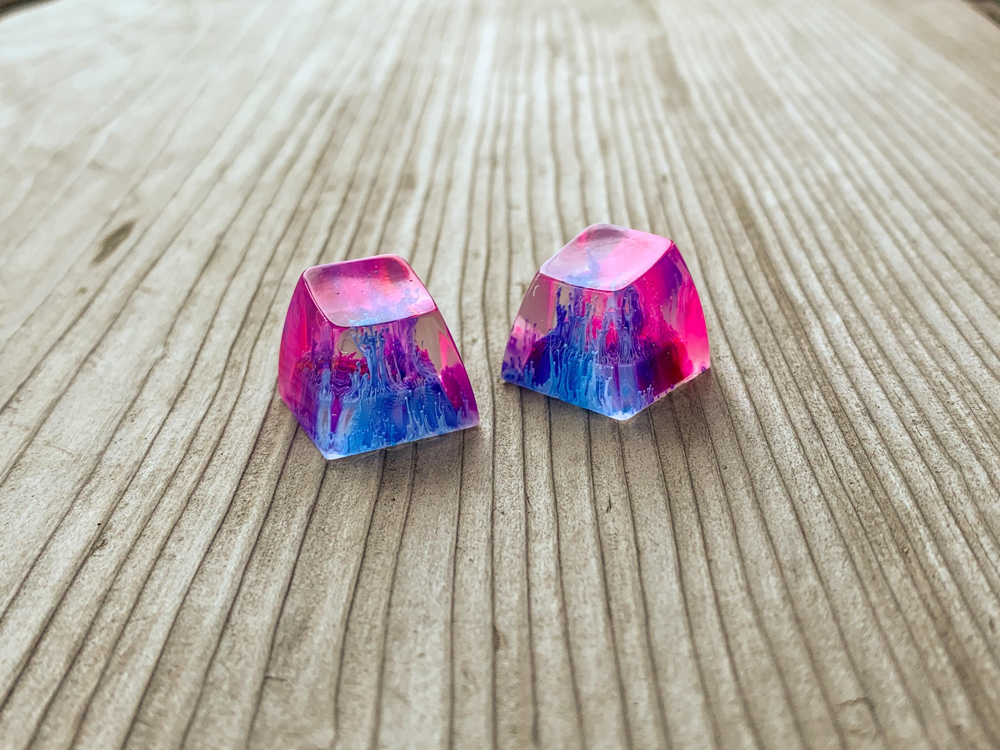

必要なもの
- キーボードの原型メルカリで買った
- Zbutt https://www.zappycappys.com/pages/z-butt
- シリコン https://amzn.asia/d/jlNhE6s
- クリスタルレジン https://www.monotaro.com/p/7205/4746/
- アルコールインク https://www.etsy.com/market/pinata_alcohol_ink?ref=lp_queries_internal_bottom-5
- 防毒マスク https://www.monotaro.com/g/01321474/
- ニトリル手袋 https://www.monotaro.com/g/04624521/?t.q=ニトリル手袋
- エプロン

手順
https://github.com/imyownyear/Z-Butt/wiki

コツ
レジンは湯煎すると粘度が下がって気泡が抜けるよ
- ただし粘度が下がるので装飾は沈みやすい
1 時間まつ
- クリスタルレジンは硬化気持ち早い
レジンの割合守らないと硬化しないのでちゃんと守ろう
- 色 1 滴白 1 滴✕
- 色 3 滴白 3 滴○
白が重いのを利用して色と白は交互に 1 滴ずつ入れていく
白は少し爪楊枝とかで混ぜると底につきにくい
白を入れてから 10 分くらいは蓋しない
最後にレジンを追加すると軸が強くなる

デザイン
名刺やステッカー、SNS のアイコンなどは以下
https://www.figma.com/file/s8UXaaxl0hZDOWgTfYNmBZ/JaxxKeycaps?node-id=0%3A1

マーケティング
Twitter
- 日本の人が多い
- 普段の雑談っぽいことを投稿しても良さそう
Instagram
- 海外の人が多い
- トレンドを追ったものやおしゃれな投稿のほうが良い
- プロフィールにブースのサイト掲載
- 買い物アカウント
- 1 万人超えないとショップやリンク貼れない！
- https://help.instagram.com/337910740093030/
- とりあえずフォロワー取得目標
- (メロンズキーキャップ参考)
- 製作過程
- アンケート(どっちが好き？）
- 投稿
- 販売キーキャップ（購入はプロフィールから）
Reddit
- https://www.reddit.com/r/MechanicalKeyboards/s/Tm4RwJpoUM
- 

販売
写真を取る
Lightroom で加工・補正する
Google Drive のこのディレクトリにアップする
- https://drive.google.com/drive/folders/1HS6-RF8-WMcukgGjogeC4BYPFe7RHuIh?ths=true
- ファイル名は既存のやつに倣って
BOOTH に登録する
- 商品管理から
- 説明文とかの内容は既存のやつに倣って
Facebook カタログに登録する（Instagram でリンク貼れる）
- このスプレッドシートに行を追加すると一時間おきに更新される
- https://docs.google.com/spreadsheets/d/1qQNF7T_aEWJeVmPZc_4XN0eM0C0Ju94NjoKVcDYHk3w/edit#gid=2078879708
- Facebook カタログマネージャーに登録される
- https://www.facebook.com/products/catalogs/314995313215228/products
- Instagram の商品タグを追加できる

実店舗
遊舎工房の Artisan Keycaps 委託販売
https://yushakobo.jp/news/2019/09/06/artisan/
受付商品：Artisan キーキャップ
受付個数：1～5 個
委託期間：3 カ月（延長あり）
最低設定価格：3,000 円（税別）
委託料：20%

配送
クリックポストを利用して住所と氏名を入力して決済を済ませる
- https://www.post.japanpost.jp/service/clickpost/
印刷用紙を PDF でダウンロードしてネットプリント
- https://networkprint.ne.jp/sharp_netprint/ja/mypage.aspx
包装する
- メッセージカードを書く
- https://www.amazon.co.jp/gp/product/B07RRNJWJ3/
- ステッカー
- メッセージカード
郵便局かポスト

追加で購入したもの
レジンだけでなくスカルピーにも挑戦した
- スカルピー
- ヒートガン

3D プリンターも買った

写真を綺麗に撮る用途で一眼レンズ（マクロ）も購入した

以下は将来
Google Form の方法
https://github.com/imyownyear/Z-Butt/wiki/Making-Money
https://github.com/imyownyear/Z-Butt/wiki/Google-Forms-raffle-setup
Paypal の決済方法がわかってない

