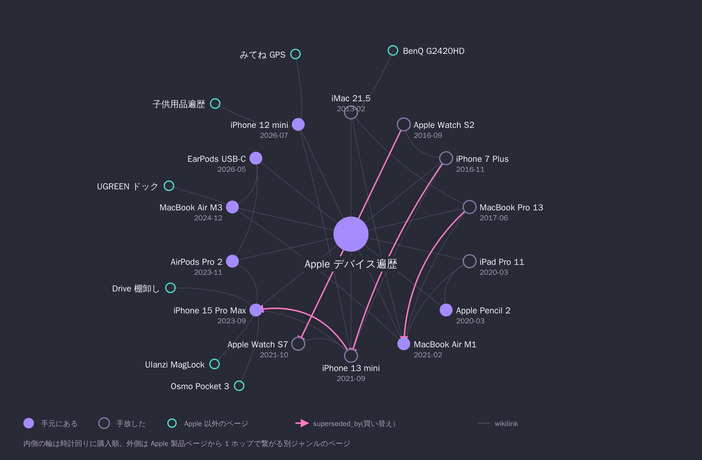

[Cline](/cline-review)が出てきたとき、これを一番使いこなせるのは物書きの人だろうと思っていました。文章を書いてきた人には、これまでのナレッジが文章の形で手元に残っています。それを渡せる人が強いはずです。自分は物書きではないので、単純に焦りました。

それから 1 年半ほど経って、自宅の NUC で[Hermes Agent](https://hermes-agent.nousresearch.com/)を常駐させ、購入履歴や位置情報や室温を渡すようになりました。

TL;DR:

- `raw/`に`purchases/`と`home/`を足して、Gmail の注文確認メールと Home Assistant のセンサー値を機械的に流し込んでいる
- 「これまで買った Apple 製品」も「次の買い替え時期」も、前置きなしで答えが返るようになった
- wiki のページを書いているのはエージェントで、自分は素材を置いているだけ

## 前置きを書くのが面倒になった

きっかけは買い物の相談でした。「そろそろ買い替えたい」と DM に投げるたび、前置きから書いていました。今どの機種を使っていて、いつ買って、何年目で、何が不満か。前置きが本題より長い。しかも書いた前置きはセッションが終われば消えます。

構成そのものは前に 2 本書いています。[OpenClaw から Hermes Agent へ移行した](/openclaw-to-hermes-agent)話と、[定額プランに移して節約のための設計をやめた](/hermes-opencode-go)話です。ざっくり言うと、NUC (Intel N95/8GB) の systemd user service で Hermes Agent が常駐しています。Telegram と Slack の DM で話しかけられて、cron で定期タスクを回します。

その上に[Karpathy の LLM Wiki パターン](https://gist.github.com/karpathy/442a6bf555914893e9891c11519de94f)で作ったナレッジベースが載っています。生ソースを`raw/`に不変で置き、エージェントがそれを読んで`entities/` `concepts/` `comparisons/` `queries/`に相互リンク付きの Markdown を書きます。規約を書いた SCHEMA.md だけは自分が手で書いています。Hermes Agent には[llm-wiki skill](https://github.com/NousResearch/hermes-agent/tree/main/skills/research/llm-wiki)が同梱されているので、パターン自体は skill を有効にするだけで動きます。

## raw/ に何を置いているか

llm-wiki skill が定義している`raw/`の下は`articles/` `papers/` `transcripts/` `assets/`の 4 つです。記事・論文・議事録・添付ファイルなので、人間が書いた文章を読ませる想定になっています。

自分の wiki では、ここに 2 つ足して 6 つで運用しています。

```text
raw/
├── articles/      # skill の既定。読んだ記事
├── papers/        # skill の既定
├── transcripts/   # skill の既定。cron の報告ログ
├── assets/        # skill の既定
├── purchases/     # 追加。注文確認メール 1 通 = 1 ファイル
└── home/          # 追加。家のセンサー値の日次スナップショット (月 1 ファイル)
```

`purchases/`の中身はこうなっています。frontmatter に機械可読な値を置いて、本文には抽出元の情報だけ残します。

```yaml
---
shop: store
order_date: 2024-12-02
price: ...
message_id: <Gmail の message id>
ingested: 2026-07-23
sha256: ...
---
```

今は`purchases/`に 2009-01-14〜2026-07-30 の 604 件があり、うち 495 件は金額まで読み取れています。`home/`には毎日 06:00 に、[Home Assistant](https://www.home-assistant.io/)から取った室温・湿度・外気温・エアコン 3 台の積算電力・観葉植物の土壌水分が 1 行追記されます。

cron は全部で 18 本あります。ライフログの収集に関わるのは 6 本。

| ジョブ | 頻度 | やること |
| --- | --- | --- |
| purchase-tracker | 日曜 21:30 | 直近 8 日の注文確認メールを`raw/purchases/`に落とす |
| purchase-explorer | 水曜 21:30 | 過去分を 1 年刻みで遡る。新規ゼロが 3 回続いたら自分を停止する |
| takeout-ingest | 毎月 25 日 | [Google Takeout](https://takeout.google.com/)の zip からマップの保存場所を取り込む |
| home-metrics | 毎日 06:00 | HA の REST API を叩いて日次行を追記する |
| possession-audit | 四半期 | `owned: true`のページと HA のデバイス状態を突き合わせる |
| monthly-rollup | 毎月 1 日 | 環境・購入・発信・wiki 活動を 1 節にまとめる |

purchase-explorer が自分を止める設計にしているのは、過去分の取り込みには終わりがあるからです。まだ試していない検索クエリを 2〜3 個だけ試して、結果を状態ファイルに書きます。3 回連続で新規ゼロになったら「探索完了」と報告して`hermes cron pause`を自分に対して実行します。

possession-audit は逆に、集めたものを読む側です。`owned: true`のページ 107 件と、HA が返すデバイスの状態を突き合わせて、購入から 1 年以上経ったもの・status が未設定のもの・HA 上で何か月も状態が動いていないものを報告します。ページの書き換えはしません。status を変えるかどうかは自分が決めることなので、報告と記録までで止めています。

## Gmail と Drive の繋ぎ方

Google 側は[google-workspace skill](https://github.com/NousResearch/hermes-agent/tree/main/skills/productivity/google-workspace)経由です。OAuth のトークンを NUC 側に置いて、cron のプロンプトから`google_api.py`を叩きます。

```bash
python google_api.py gmail search \
  '(label:買い物 OR category:purchases) -label:買い物-取込済 newer_than:8d' --max 50
```

受信時フィルタで注文確認メールに「買い物」ラベルを自動付与しておいて、処理済みには別ラベルを付けて次回の検索から外します。`category:purchases`を OR で足してあるのは、フィルタに登録していないショップを取りこぼさないためです。

ここで踏んだ罠が 1 つあります。OAuth クライアントの公開ステータスです。Testing のままだと refresh token が 7 日で強制失効します。毎朝動いているジョブが`invalid_grant`で落ちるまで気づきませんでした。

恒久対策は[Google Cloud コンソール](https://console.cloud.google.com/auth/audience)で In production に公開することです。ただし 7 日上限はトークン発行時点のステータスで決まるので、公開しても既存のトークンには遡りません。公開だけして満足すると、7 日後に同じ失効を踏みます。再認証まで済ませて 1 セットです。

位置情報の方は Google Takeout です。月次エクスポートを予約してあって、Drive へ落ちた数日後に cron が拾います。マップの保存場所は 213 件。スターを付けた最古の記録は 2011-05-17 でした。

## 前提知識なしで聞けるようになった

こうして溜まったものに対して、DM で普通に質問します。たとえば「これまで買った Apple 製品」と聞くと 13 点の表が返ってきます。長いので 4 行だけ抜きます。

| デバイス | 購入 | 現状 | 後継 |
| --- | --- | --- | --- |
| iMac 21.5 (Mid 2013) | 2013-02 | sold | — |
| Apple Watch Series 2 | 2016-09 | disposed | → Series 7 |
| iPhone 7 Plus | 2016-11 | disposed | → 13 mini |
| MacBook Air M3 | 2024-12 | in-use | — |

表はただの集計ですが、その先も書いてありました。買い替えは 2016〜2017 年・2020〜2021 年・2023〜2024 年に固まっていて、周期は 3〜4 年。次は 2027 年前後だろう、と。

「次の買い替えタイミング」を聞くと、この周期と四半期の棚卸しを突き合わせた答えが返ります。棚卸しが挙げるのは「買って 1 年以上たっていて、まだ手元にあるもの」62 件。上位は 7〜8 年目の照明やスマートスピーカーで、ガジェットより先に生活まわりが出てきます。ここまで、こちらからは何も説明していません。

図にするとこうなります。



内側の輪が Apple 製品ページで、時計回りに購入順です。ピンクの矢印が`superseded_by`、つまり買い替えを表します。外側にいるのが Apple 以外のページで、ドックやモニタのような周辺機器もあれば、子供用品遍歴やみてね GPS のように別ジャンルのハブもあります。

## 種類の違うログが勝手に繋がる

面白いのはこちらでした。

2026 年 1 月に vlog カメラの DJI Osmo Pocket 3 を買っています。これは Amazon の注文確認メールから入った記録です。一方、2 月のグアム旅行は航空券とホテルの予約メール、それにマップの位置情報から入っています。経路も時期も別々なのに、旅行のページにはこう書いてありました。

> `[[dji-osmo-pocket-3]]`の購入(2026-01-08)は出発 26 日前で、`[[camera-gear-history]]`の「2026 動画シフト期」はこの旅行が起点の可能性が高い

購入履歴だけを見ても、旅行の記録だけを見ても出てこない話です。カメラ遍歴のページには「2026 年は動画に寄っている」という読みがあり、旅行のページには出発日がある。その 2 つが`[[wikilink]]`で繋がっているので、どちらが先かという推測まで書けています。しかもこの推測、当たっていました。グアムで撮った vlog が YouTube に上がっていて、それも Takeout から裏を取ったと書いてあります。

リンクは非 raw の 169 ページに対して 1,598 本あります。1 件の注文確認メールを取り込むと、製品ページが増え、遍歴ページの表に行が増え、棚卸しの件数が変わります。この更新を毎回手でやる気はないので、LLM がやってくれるのはありがたい。

## 書いているのはエージェント

冒頭の話に戻ります。

渡せるナレッジを持っている人が強い、という見立ては、たぶん半分は当たっていました。抜けていたのは、ナレッジが文章の形をしている必要はない、という方です。

注文確認メールも、マップに付けたスターも、家の温度計の値も、意図して書いたものではありません。それでも 17 年分あれば、何を買って何を手放したかも、どこへ行ったかも残っています。`raw/`に置いたら、要約も相互参照も索引の維持もエージェントがやりました。

## 次にやりたいこと

Cloudflare が 2026 年 8 月に[Cloudflare Wallets](https://blog.cloudflare.com/wallets/)を発表しました。エージェントに使わせるための財布で、支払いには[x402](https://github.com/coinbase/x402)という HTTP 402 に乗せる規格を使います。人間が持つ Account Wallet に入金しておいて、エージェントが操作する Virtual Wallet へ権限を切って渡します。2026-08 時点で触れるのはハンドルの予約までで、Virtual Wallet はまだ使えません。

やってみたいのは、これを繋いだ状態で買い物を任せることです。604 件の購入履歴と、家の温度と、所有物 107 件の棚卸しを持っているエージェントに、予算を渡したら何を買うのか。

予想は 2 つあって、どちらになるか分かりません。1 つは消耗品を淡々と補充する保守的な動き。棚卸しに 8 年目のシーリングライトが並んでいるので、そのあたりを替えにいくかもしれません。もう 1 つは、運動不足を見抜いて運動器具を買ってくるパターンです。
