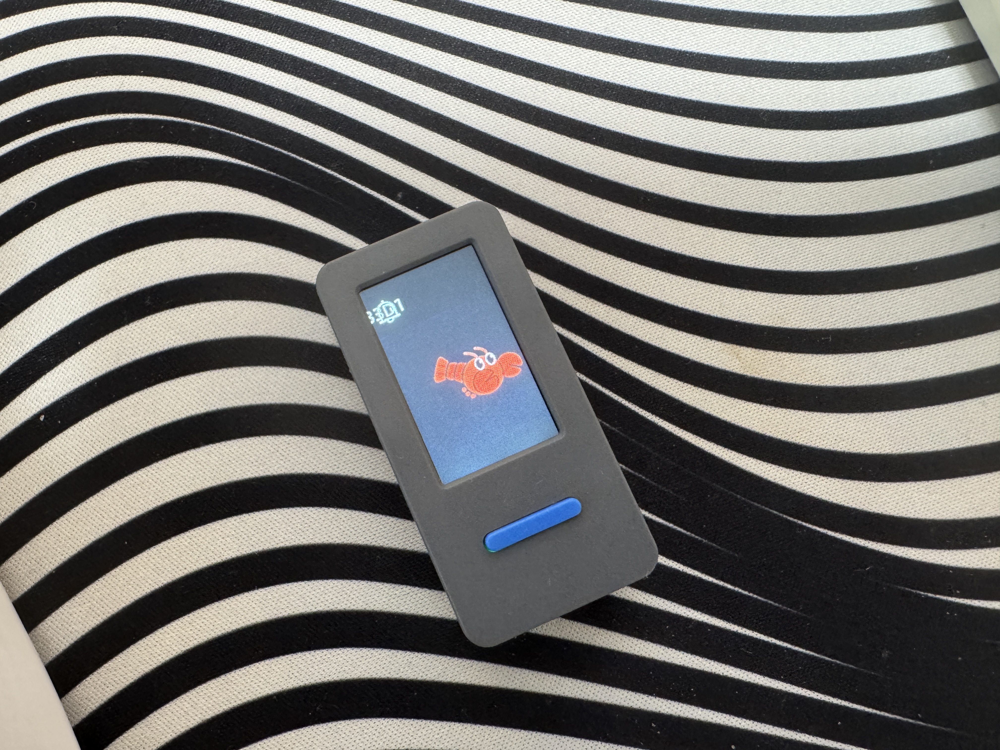

最初は正直メリットがわからなかった、けど数日使ってみての感想

　（コスパ面）OpenClaw と比較すると機能は限定的。だけど Mac mini や n150 ミニPCに OpenClaw を入れて、重い推論はクラウドのLLMに投げる構成にする場合、手元のマシンに残るのはイベント処理・ルール実行・記憶・周辺機器制御くらいで「これ、オーバースペックでは」と感じていた。それが ESP32 上で安価にできるのは嬉しいし、多くの人はこれで満足する気がしている。

　（どういう将来性があるか）既存のIoTは、Google Home / Alexa / Home Assistant のように製品同士を束ねるダッシュボード役のソフトを別に用意する必要がある。ここに ESP-Claw を載せた安いESP32が家に1個いて、MCPで家電を束ねると、機能的にはハブなのだが、従来のダッシュボード型と違って安く、そして実行時にその場で判断して家電操作を自動化してくれる。従来ハブとの差は結局この「判断を実行時に持つか」の一点に集約される。

　　ただ、自分自身は Home Assistant を Claude Code で設定管理していて、これは判断を設定時に寄せて実行時は決定論的ルールで固める方式になっている。実行時は外さないし、速くて安い。この観点で見ると、ESP-Claw が実行時に判断を持ち込むのは、ルールベースの強み(実行時の安定)を削って弱み(遅い・高い・たまに外す)を増やす方向にも見える。

　　なので ESP-Claw の将来性が本当に効くのは、「事前にルール化する」という前提そのものが崩れる場面に絞られる。状況のパターンが多すぎて列挙しきれない、あるいは何を自動化したいか人間側もまだわかっていない探索段階——そういうルールが書けない領域でこそ、実行時判断に価値が出る。逆にルールが書けるなら書いた方がいい。普及の要は賢さより”外さなさ”で、そこを越えられるかが鍵になる気がする

