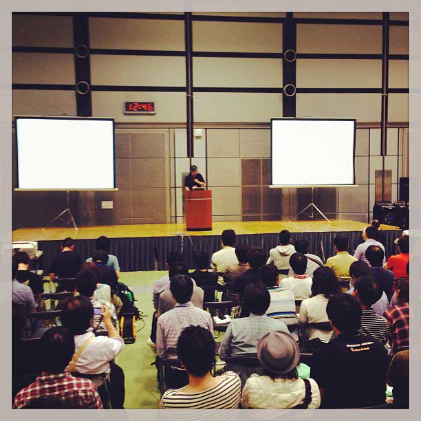
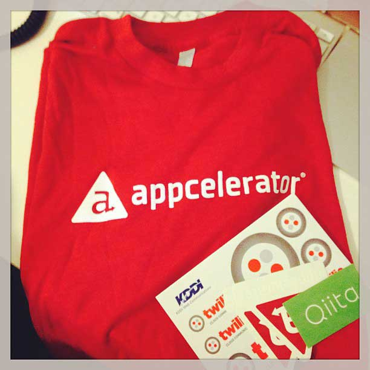

去年に続き、今年も参加してきました。楽しかったぞ！

## 12：30 会場に到着

電車に揺られうとうとしながら着きました。

会場は大田区産業プラザ PIO です。

<!--more-->

## 13：00 テクニカルセッション

WordPress のメリット・デメリットや、プラグイン利用の際の注意点、

プラグインをどんどん公開していこーよ的な話がありました。

ノウハウやコードとどう向き合っていくか、勉強になりました。

## 13：45 企業ブースぶらぶら

ステッカーだ！　飲み物だ！　歯ブラシだ！

## 14：00 セキュリティセッション

少し前、話題になったセキュリティ問題の話

改ざんを未然に防ぐため何をすればよいか、また実際被害に遭った際どのような行動をとればよいのか。

などなど聞けました。

スタッフさんのリレーブログで１つ MovableType が使われているとかでおもしろかった。

## 16：00 帰宅

ステッカーたくさんいただきました。貼るぞ。

そしてモチベーション上がったので勉強するぞー。

