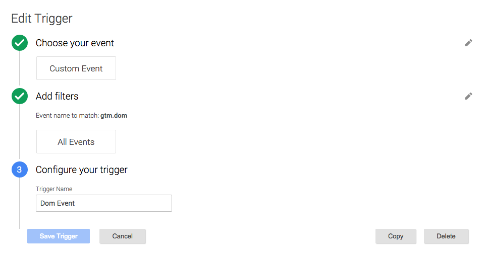
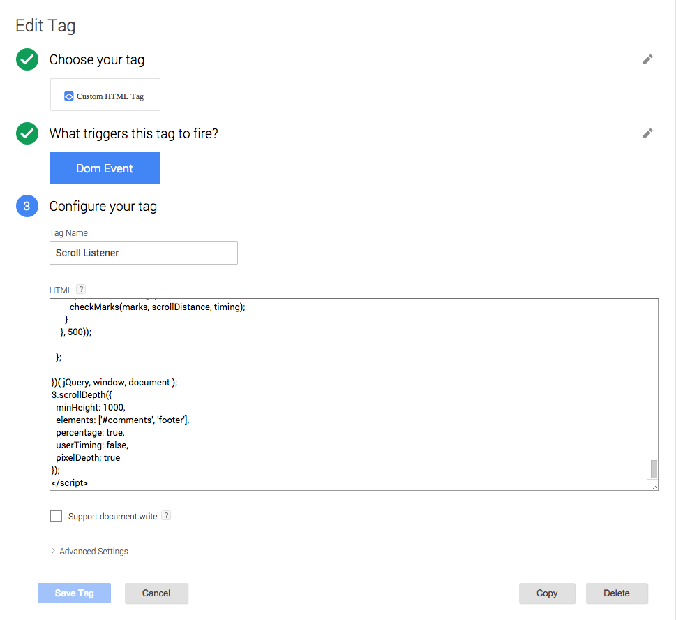
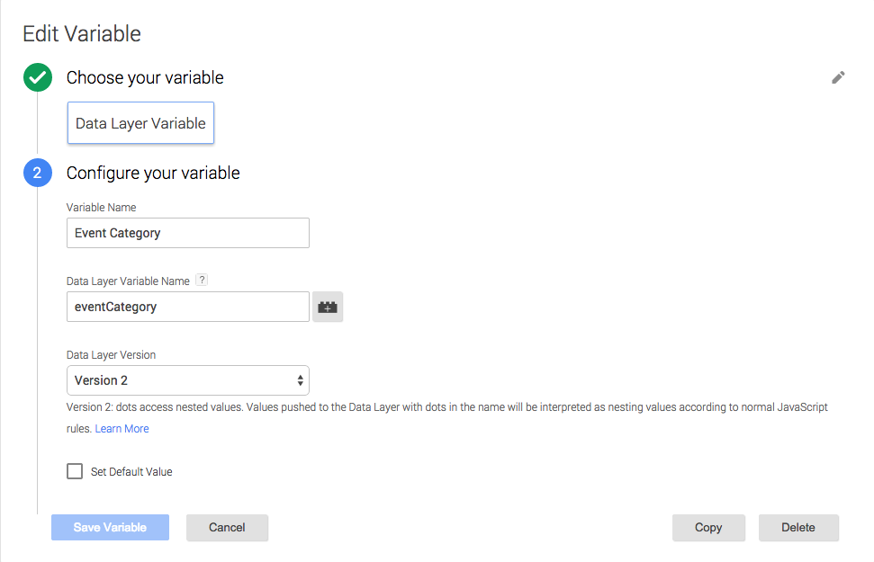
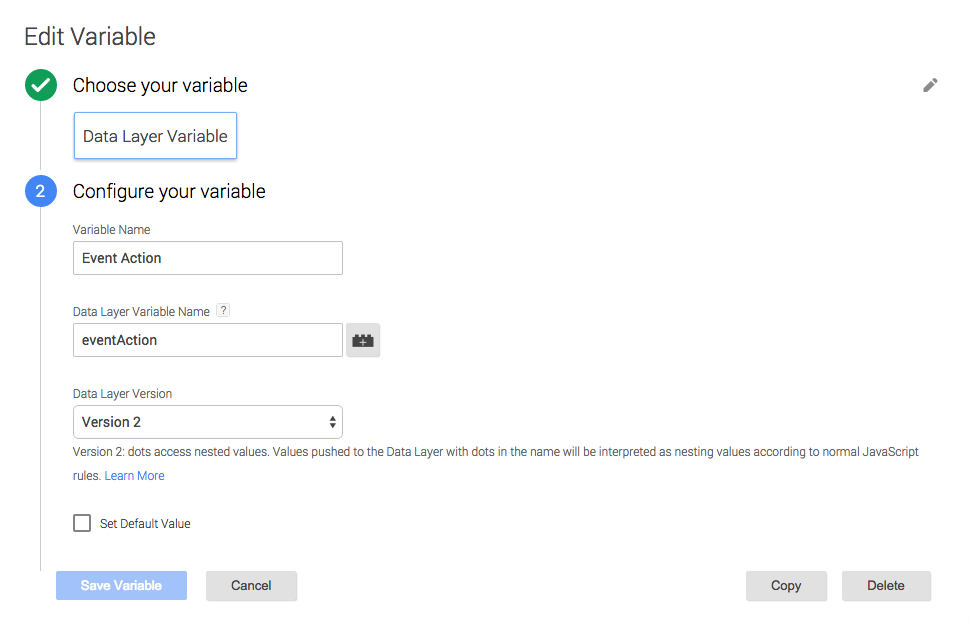
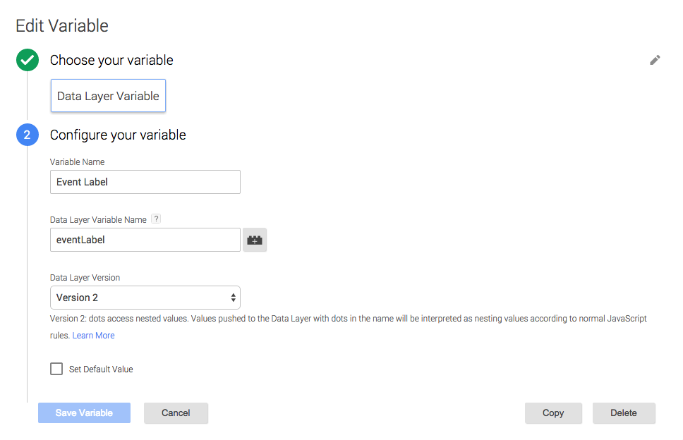
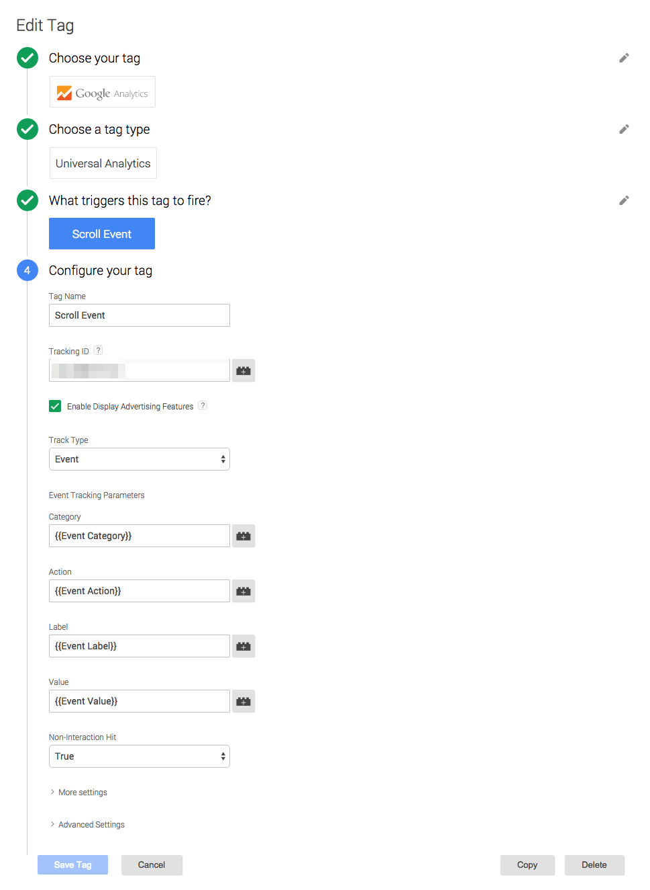

GoogleAnalytics で離脱率や平均セッションを見ていて、

ユーザーがページのどこまで目を通しているのか気になりました。


海外の技術ブログや GitHub でも評価のある、

「Scroll Depth」というライブラリを使用します。要件として jQuery1.7 以上です。

<!--more-->

> Scroll Depth
> http://scrolldepth.parsnip.io/

これとタグマネージャーを連携してスクロール計測を行いたい思います。


## Dom Event の設定

まずは「Triggers」（旧:ルール）からイベントを登録します。

「Scroll Depth」を実行する際にスクロール幅の計算を行うため、

読み込み完了イベントの「gtm.dom」を「Dom Event」として登録します。



## Scroll Listener の設定

次に「Tags」（旧:タグ）からライブラリを「Scroll Listener」として登録します。

以下 GitHub の「jQuery.scrolldepth.js」を script タグで挟んで貼り付けてください。

> robflaherty/jquery-scrolldepth**
> https://github.com/robflaherty/jquery-scrolldepth



タグの最後に実行タグを追記します。

オプションで計測する項目のオンオフができます（ほかにも有り）

```
$.scrollDepth({
  minHeight: 1000, //計測実行する最小のページ高さ
  elements: ['#comments', 'footer'], //計測するスクロール要素
  percentage: true, //スクロール率の計測有無
  userTiming: false, //ユーザーのスクロールイベント有無
  pixelDepth: true //スクロール幅の計測有無
});
```

「Scroll Listener」を発行するタイミングは先ほど用意した「Dom Event」を使います。

## Scroll Event の条件設定

次に「Triggers」（旧:ルール）から「Scroll Listener」のイベント登録します。

イベント名は「ScrollDistance」と入力します。


## dataLayer の設定

次に「Variables」（旧:マクロ）から「Scroll Listener」の 4 つのデータレイヤ変数を登録します。

「eventCategory」



「eventAction」



「eventLabel」



「eventValue」


## Scroll Event の設定

最後に「Tags」（旧:タグ）から Analytics のプロファイルを選択して、

各項目を入力すれば設定完了です。



デバッグモードで PC からでもスマートフォンからで取得できていれば完了です。

満足感で公開を忘れないよう気を付けてください。
