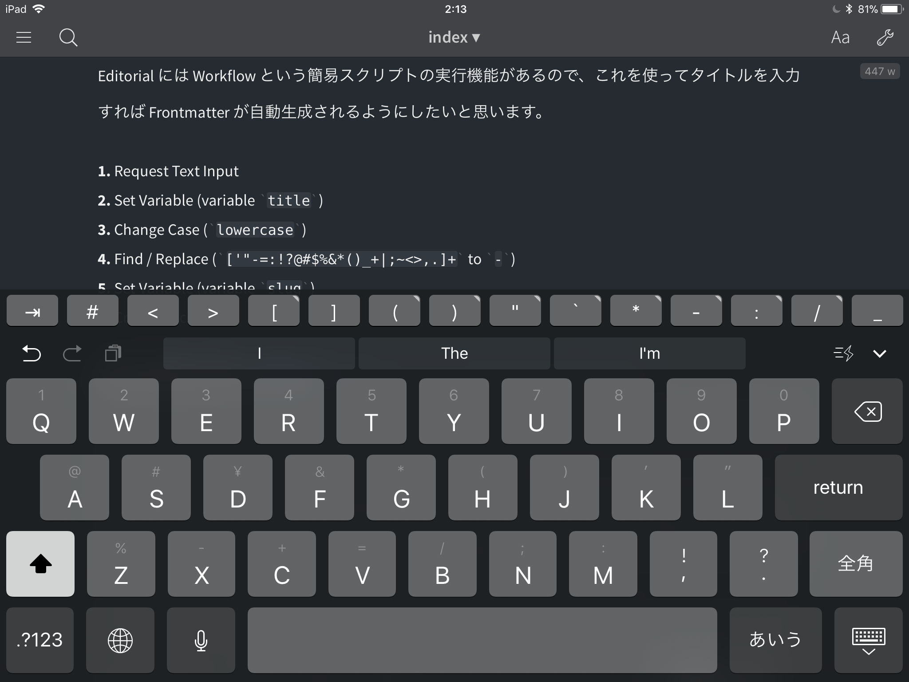

このブログは静的サイトジェネレータを使って書いてます。

マークダウンなので文章自体は書きやすいんですが、WordPress と違って iPad や iPhone から更新する方法はいまひとつな感じでした。通勤時間や寝る前のちょっとの時間を有効活用したかったので、試している方法を書いておきます。

## 同期設定
複数の端末からアクセスできるように Markdown を置いているフォルダを Dropbox フォルダにシンボリックリンクを貼ります。写真とかも携帯からアップしやすくて便利かもです。

## エディタ
iPad 向けエディタは 1Writer、Bear、Byword などなど、
たくさんあるんですが個人的には Editorial が一番使いやすい感じがしました。

> Editorial
> http://omz-software.com/editorial/

マークダウンが書けて記号をタイプしやすいようキーボード拡張がついていて Dropbox 連携もできて、さらに後述する Workflow という機能があるのでお勧めです。

インストールした後は Dropbox 連携を済ませておきます。

<!--more-->

## Frontmatter を自動生成するように設定する
Editorial には Workflow という簡易スクリプトの実行機能があるので、これを使ってタイトルを入力すれば Frontmatter が自動生成されるようにしたいと思います。

1. Request Text Input
2. Set Variable (variable `title`)
3. Change Case (`lowercase`)
4. Find / Replace (`['"-=:!?@#$%&*()_+|;~<>,.]+` to `-`)
5. Set Variable (variable `slug`)
6. Create Document

設定が面倒な場合は [Workflow リンク](editorial://add-workflow?workflow-data-b64=eNrVVdtu00AQ_RWzUG6xg52mFJZLgCJUJAoojehDXcFiT5yl9q7ZXTeJgvkH3pD4AT4N_oLxOiFJ04f0JYKsFK3PzJyZMzteTwiPpCCUZFxUO-3V_0yZoVSnXg7CC5q5SIhLWGQ42gg9npCcFRqeQV8q6BZCcHSgfZZqcGvTETcDWZjDgRyi7S1TLAMDSv_1igptZNbjJgXMjuxRyjSayRGm7ady-NRm68LnArTpwci8FHlhSMU_J5sQM2cw6GShcV4hLD5jIoK4iq2s8hREl4kEqrhy5k4IbrMiNfwVF_Amr5IS6peluzmRhwYzvGOKs4_oeF6hwD2G1EJdcsbSAtaVSSa-6wQlutXdm8vukHKjGvcGVU17TK8KjBCcNT7YaFEvuIi7kKcsWq1KTfFLD5RXdbmPzJcPPb4REu8RvdJ5cvXa1vXbN2-9b3x58PXDw8du86Qxo_2HZ1SnRfIfj6gCZuA1DJ_LqMhArF42eDWaCl9b2r2dqbZpZybbwRTYijEXPTiw4M4SuL9vwftLINaLYGsZHOPP-m4vwXFswd0lMMsswazZ9XWyMLWeFwoeUydo-7uhsGbqdEJhg52QdDxcvQ7F1fB96vshCQUrsPWKOp_YaNQK_HYoUjbGs6BOLrUJRc7MAIPvIA_PWAIU-UBHitsZxqcI2ROpOGh8cBzP-f3j26-f37EAlkyhUNja6vFPoR61dQ-gdUG72xc06-65c_JX-7wwmJ5dzSyuQInfSEKNKqAsT9zZq-DU02T7gIQLqu035w_k7Ith) を用意したので Editorial がインストールされた端末から開いてみてください。

## あとはひたすら更新！
ざっとこんな感じで現在は更新しています。
いつか iPad を使って横になりながら仕事がしたい。

以下の記事を参考にしました。

> Using the iPad for: Blogging with Jekyll - Matt Gemmell
> https://mattgemmell.com/using-the-ipad-for-blogging-with-jekyll/

